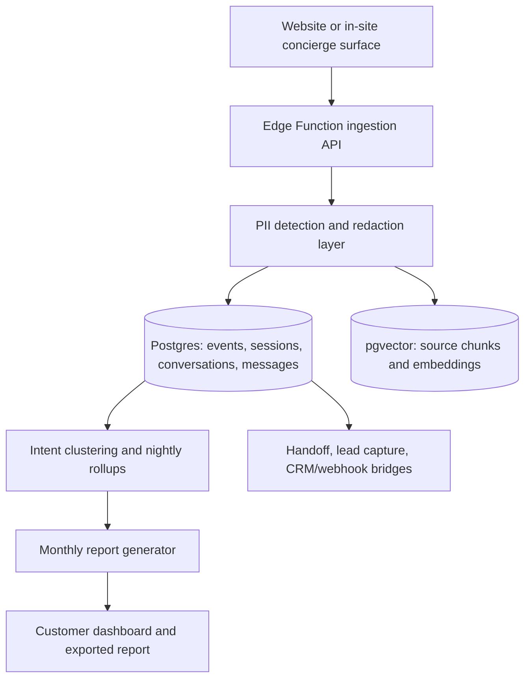

# Designing a Premium Embedded AI Concierge Entrance

## Executive Summary

The strongest pattern in the market is not “a better chatbot bubble.” It is an embedded assistance layer that appears in the same places people already orient themselves: search, page context, product detail, empty states, side panels, home cards, and lightweight nudges. The best examples make asking feel like the next obvious move, not a separate mode switch. Command-style discovery on entity["company","GitHub","developer platform company"] and entity["company","Linear","project management company"], current-page assistance in entity["company","Microsoft","technology company"] Edge and entity["company","Google","technology company"] Chrome, embedded documentation assistants from Docus and entity["company","Algolia","search software company"], and contextual product help in entity["company","Amazon","ecommerce company"] Rufus all point to the same conclusion: the entrance should be contextual, scoped, and visibly useful before the user types anything. citeturn13view0turn16view3turn13view1turn16view4turn16view5turn13view21turn13view22turn13view23turn25view1turn25view2

For your product, the most defensible strategy is a **distributed entrance system** with three layers: a contextual invitation on important pages, a branded but lightweight persistent re-entry point, and prompt-starter chips/cards that lower the cost of asking. This is the practical synthesis of current product patterns and UX research: suggested prompts should be clickable buttons, assistance should remain accessible across pages, and the system should clearly signal what it knows about the current page or task. Users are much more likely to engage when the interface reduces articulation effort, helps them scope the task while they are already in context, and avoids forcing them to “invent” the first question from scratch. citeturn15view0turn15view1turn15view2turn15view3turn15view5turn23view2turn24view2turn14view0

The analytics opportunity is large enough to be a product pillar, not a side effect. Current platforms already treat conversation logs as signals for unresolved topics, content gaps, intent detection, self-serve performance, and commercial follow-up opportunities. entity["company","Intercom","customer messaging company"] groups unresolved questions by topic and links them to missing content; entity["company","Zendesk","customer service software company"] surfaces unresolved conversations and “intents without answers”; entity["company","Help Scout","customer support software company"] reports on Beacon engagement and AI resolution outcomes; entity["company","Shopify","commerce platform company"] logs answered and unanswered AI shopping questions; and entity["company","Command AI","user assistance software company"] highlights trending and failed searches as product signals. A monthly customer report should therefore center on themes asked, unanswered demand, objections, buyer stage signals, conversion assists, and the content or product changes that would improve outcomes next month. citeturn20view0turn20view1turn27view0turn31view0turn16view10

On architecture, a single entity["company","Supabase","backend platform company"] project with shared tables, strict `tenant_id` isolation, and Row Level Security is the right starting point for a small team because it minimizes operational overhead and preserves pooled analytics/reporting. That said, it should be designed from day one as an **isolation ladder**: shared-schema multi-tenant first, then schema-level or project-level isolation for higher-risk customers later. Privacy-wise, the entrance should use point-of-use disclosure, privacy-by-default settings, short raw-text retention, redaction for analytics, clear deletion paths, and explicit limits on secondary use of conversation data. citeturn13view11turn13view13turn13view14turn18view0turn13view15turn21view0turn22view0turn21view1turn5search6

## What the Market Already Shows

### Embedded assistance beats generic chat

Across the market, the most successful AI entrances are attached to existing navigation and search behaviors rather than presented as isolated chat bubbles. GitHub’s command palette offers context-aware suggestions and actions from anywhere on the site, while Linear’s search and command menu make intent capture feel like navigation, not support. Algolia’s Ask AI is explicitly layered into DocSearch so conversational answers do not break the developer workflow, and Docus emphasizes asking questions without leaving the page while using the current page as context. Microsoft Edge and Google Chrome both formalize “ask about this page” as a side-panel behavior tied to the current tab rather than an all-purpose bot. citeturn13view0turn16view3turn13view22turn13view23turn13view1turn16view4turn16view5

Useful visual references for a moodboard include the official screenshots of the GitHub command palette, Amazon Rufus product-page prompts and comparison UI, Intercom’s Messenger Home/article card layouts, and Microsoft Edge page summarization surfaces. These are good reference points because they all make assistance visible without making it feel like a default support widget. citeturn13view0turn25view0turn25view2turn26view0turn26view1turn13view1

image_group{"layout":"carousel","aspect_ratio":"16:9","query":["GitHub command palette screenshot", "Amazon Rufus compare with similar screenshot", "Intercom Messenger home article search screenshot", "Microsoft Edge Copilot page summary screenshot"], "num_per_query": 1}

### The best entrances are contextual and scoped

Amazon Rufus is especially instructive because it meets users at multiple shopping moments: inside the search experience, on product detail pages, through related questions, and through a “Compare with Similar” action. It also uses page-specific context such as listing details, reviews, and Q&A to answer product questions. That is materially different from a generic assistant that waits in the corner and asks users to restate the page they are already on. citeturn25view1turn25view0turn25view2

Intercom shows a second strong pattern: the “entrance” can be a home of cards and actions, not a chat box. Messenger Home can be configured with article search, news cards, checklists/tasks, demo request cards, order status, and other audience-targeted apps. Its article-search card can even show suggestions before users search, and teams can require help search before starting a conversation. Help Scout follows a similar path by making the opening screen configurable, keeping AI grounded in docs content, and exposing reporting instead of treating the assistant as a standalone novelty. citeturn26view0turn26view1turn16view7turn16view8turn27view0

Onboarding and product-adoption tooling reinforces this direction. entity["company","Pendo","product experience software company"] documents tooltip guides that can be triggered by badges or inline interaction, and entity["company","Appcues","product adoption software company"] documents checklists that appear as a floating beacon users open when ready. Those are established, non-chat patterns for invitation and guidance, which makes them especially relevant for a premium concierge entrance that wants to feel playful and embedded rather than bot-like. citeturn16view14turn16view15turn16view16

### The research consensus is clear

The most relevant UX research is unusually aligned. entity["organization","Nielsen Norman Group","ux research firm"] says site-specific AI tools should clearly state capabilities, offer relevant prompt suggestions, and signal that they know what the user is looking at. It also recommends suggested questions as buttons, not plain text, and emphasizes continuity across pages. entity["organization","Baymard Institute","ux research organization"] shows that scoping and suggestion timing matter: users struggle when autocomplete and search do not help narrow scope while they are typing, and category-bounded search behavior is common enough that missing it causes abandonment. Adobe’s published research on proactive question suggestions adds that context-aware suggestions improve discoverability and usefulness in enterprise AI systems. citeturn15view1turn15view2turn15view0turn24view1turn24view0turn24view2turn14view0

## What Makes Visitors Ask

### Lower the articulation burden

Users often know they need help before they know how to phrase the question. NN/g defines prompt suggestions as system-generated hints that showcase capabilities, reduce effort, and encourage exploration; its research on prompt controls shows that buttons, cards, toggles, and menus can increase discoverability, inspire use cases, set constraints, and facilitate follow-ups. Its more recent AI-literacy work also recommends clickable refinements, lightweight controls for common filters, and brief clarifying questions instead of forcing users to do all the work. citeturn15view3turn15view5turn23view2

That maps directly to your entrance problem. Visitors ask more when the UI provides one of three kinds of scaffolding immediately: a plausible first question, a useful scope, or a reassuring example of what the concierge can do here. This is why related question chips in Rufus, starter prompts in AI assistants, article suggestions in Messenger, and page-specific question presets in Docus matter so much. They convert vague curiosity into a concrete first action. citeturn25view2turn26view1turn13view23turn13view4

### Put the invitation where the user’s intent already exists

The highest-confidence pattern in the research is contextual timing. Baymard finds that scope suggestions work best while users are typing, because that is the moment they realize a query might span more than one category. Microsoft Edge, Chrome AI Mode, and Docus attach assistance to the current page or tab. Amazon Rufus attaches help to the product detail page and comparison action. These patterns all reduce “mode switch” cost by surfacing help at the exact moment the user has local intent. citeturn24view2turn13view1turn16view4turn16view5turn13view23turn25view1turn25view0

For your product, that means the entrance should be page-template aware. On a pricing page, the invitation should bias toward plan fit, implementation questions, and objections. On a product detail page, it should bias toward comparisons, compatibility, and policy questions. On an article page, it should bias toward “ask about this page,” “summarize,” or “show me the next step.” A single sitewide bubble cannot communicate that fidelity as well as embedded, contextual surfaces can. This is an inference from the patterns above rather than a feature one vendor states directly, but it is strongly supported by current-page assistants, scoped search UX research, and proactive question-suggestion research. citeturn14view0turn15view2turn24view2turn13view23turn25view1

### Signal competence, not character

Trust comes more from competence than from personality. NN/g’s trust research summarizes the current evidence succinctly: people trust AI more when it seems smart rather than sentient, and emotional or anthropomorphic cues can reduce trust in factual, task-oriented work. Separately, its diary study of chatbot use found that people expect concise, specific answers that consider contextual cues. citeturn23view0turn23view1

That does not mean the entrance cannot feel playful. It means the playfulness should live in motion, polish, and microinteractions rather than in faux-human banter. The premium tone should be “confident concierge,” not “cute companion.” In practice, that means crisp labels, visible scope, short answer previews, clean citation or verification affordances, and follow-up suggestions that feel useful immediately. citeturn23view0turn23view2turn15view0

### Keep privacy friction proportional

Visitors will ask more if privacy expectations are legible and proportionate. Government guidance is consistent here: point-of-use explanations should say what data is collected, why, how long it is kept, whether it is shared, and how people can exercise rights; privacy-preserving defaults should be enabled unless users choose otherwise; and transparency should extend beyond a buried privacy notice. The FTC also warns that using retained consumer data for new purposes without clear notice and affirmative express consent is legally risky. citeturn22view0turn21view0turn21view1

For product design, the implication is simple: do not ask for an email at the entrance. Ask only when the user wants a durable outcome such as a transcript, a demo, a quote, or a follow-up. Help Scout’s configuration options make this distinction explicit by allowing optional email capture and separate fallback/handoff copy when the AI cannot help. citeturn27view0

## UX Principles and Interaction Concepts

The entrance should follow a small set of durable principles: **context before conversation, suggestions before empty input, one persistent re-entry point, visible capability framing, competence over anthropomorphism, and privacy disclosure at the moment data becomes durable**. Those principles are the most stable synthesis of current product patterns and research findings. citeturn15view0turn15view1turn15view2turn23view0turn22view0

### Recommended interaction concepts

| Concept | What it looks like | Works best on | Strengths | Risks | Priority |
|---|---|---|---|---|---|
| **Hero question ribbon** | Thin horizontal band near the hero with 3–5 suggested questions | Home, category, campaign landing | Extremely visible; teaches capabilities immediately | Can feel promotional if too generic | MVP |
| **Concierge card in page rail** | Editorial card embedded in sidebar or content rail with prompt chips | Pricing, product, docs, listing pages | Feels premium and native; easy to brand | Less visible on mobile if buried | MVP |
| **Floating sparkle pill** | Small branded pill, not a chat bubble, with rotating short prompts | Sitewide re-entry | Persistent without screaming “support bot” | Easy to overanimate or make gimmicky | MVP |
| **Ask about this page chip** | Sticky chip reading “Ask about this page” with scoped question examples | Docs, articles, product pages | High relevance; low articulation cost | Needs page context plumbing | MVP |
| **Highlight to ask** | User highlights text/image/spec and sees “Ask” affordance | Specs, docs, comparison-heavy pages | Very low friction for validation questions | More complex cross-browser behavior | V2 |
| **Command palette concierge** | Spotlight/modal invoked by keyboard or tap target | SaaS apps, logged-in experiences, docs | Premium and fast; excellent for power users | Lower discoverability for casual visitors | V2 |
| **Scroll-triggered sidecar nudge** | Small side card that appears after reading depth or hesitation | Content-heavy pages | Good timing without blocking the page | Annoying if too eager | MVP on key templates |
| **Suggested-question deck** | Stack of tappable question cards, optionally personalized by page type | Any site with repeated intents | Makes first ask obvious; great for experimentation | Can get stale without rotation logic | MVP |
| **Quiz-style concierge entry** | “What are you trying to do?” with 2–4 branches before open text | High-consideration journeys | Great for novice users; captures structured intent | Too many steps can feel like a funnel | V2 |
| **Compare assistant tray** | Sticky footer tray with “Compare options” and scoped questions | Ecommerce, pricing, marketplaces | Converts evaluation intent into questions | Needs structured product/plan data | V2 |
| **Search rescue card** | Appears in no-results, thin-results, or zero-match search states | Search-heavy sites | Users are already asking silently here | Requires search instrumentation | MVP |
| **Checklist beacon hybrid** | Floating beacon opens a short “things I can help with” checklist | SaaS onboarding, account areas | Familiar pattern from onboarding tools | Less natural for anonymous visitors | V2 |
| **Objection unlock card** | Inline card after AI detects pricing/security/implementation objections | Pricing, enterprise sales pages | Strong revenue impact | Must avoid feeling manipulative | V2 |
| **Demo bridge card** | Card/button after high-intent answers: “Want a tailored walkthrough?” | B2B sales-led sites | Natural lead capture boundary | Too early = conversion-killing | MVP only on explicit high intent |
| **Ambient hotspot concierge** | Small badge on a complex UI element or table header | Product UIs, dashboards | Feels deeply embedded | Requires precise targeting and governance | V3 |

### Best-fit concept bundles by site type

For **ecommerce**, the strongest bundle is: floating sparkle pill, ask-about-this-page chip on product pages, compare assistant tray, and search rescue in thin-result states. That bundle maps closely to Rufus-style related questions, comparison surfaces, and page-bound product inquiry patterns. citeturn25view1turn25view0turn25view2

For **B2B SaaS marketing sites**, the strongest bundle is: hero ribbon on high-intent landing pages, concierge card on pricing and solution pages, persistent sparkle pill for re-entry, and a demo bridge only after explicit buying-stage signals. Intercom’s card-based Messenger Home and demo-request flows are good proof that these can feel embedded and commercial rather than purely support-oriented. citeturn26view0turn31view2

For **documentation and resource sites**, the strongest bundle is: ask-about-this-page, search-mode assistant, prompt starter chips, and optional highlight-to-ask. That is exactly where Docus, Algolia, Chrome, Edge, and document editors are moving. citeturn13view22turn13view23turn16view4turn16view5turn16view19turn32view0

## Analytics and Reporting Design

The core reporting question is not “How many chats happened?” It is “What were visitors trying to accomplish, what value did the concierge create, where did it fail, and what should the customer change on the site or in the product because of what visitors asked?” That framing is already visible in Intercom’s unresolved-question groups and related-content review, Zendesk’s unresolved conversations and intents without answers, Help Scout’s resolution outcomes and conversation export, Shopify’s answered/unanswered query log and top unanswered questions, and Command AI’s trending/failed-search views. citeturn20view0turn20view1turn27view0turn31view0turn20view2turn16view10

### Conceptual event taxonomy

Instrumentation should follow the core product-analytics model used by entity["company","Twilio","communications software company"] Segment, entity["company","Mixpanel","product analytics company"], entity["company","Amplitude","product analytics company"], and entity["company","PostHog","product analytics company"]: stable event names, timestamp, distinct identifier, and contextual properties; a tracking plan to validate what should exist; static property names; event versioning; and careful identity design. Backend events should be the source of truth for submit/answer/lead events, while the front end tracks impressions and UI interaction. citeturn13view17turn13view18turn13view19turn13view20

| Event | Trigger | Required properties | Why it matters |
|---|---|---|---|
| `entry_impression` | Entrance surface appears in viewport | `tenant_id`, `site_id`, `surface_id`, `page_type`, `page_url`, `session_id`, `experiment_variant` | Measures discoverability |
| `entry_click` | User opens or expands entrance | Above + `trigger_type` | Measures invitation strength |
| `starter_prompt_impression` | Prompt chips/cards render | Above + `prompt_set_id` | Evaluates discovery scaffolding |
| `starter_prompt_click` | User clicks a suggested question | Above + `prompt_id`, `prompt_text` | Shows which prompts create asks |
| `query_submitted` | User sends a question | `conversation_id`, `message_id`, `query_text`, `scope_type`, `surface_id`, `page_context_id` | Core intent signal |
| `clarification_shown` | System asks a follow-up clarifier | `clarification_type`, `reason` | Measures ambiguity and friction |
| `clarification_answered` | User answers clarification | `clarification_type`, `selected_value` | Improves intent modeling |
| `answer_completed` | Full answer rendered | `response_id`, `latency_ms`, `answer_mode`, `source_count`, `outcome_initial` | Reliability and UX quality |
| `followup_prompt_click` | User taps a follow-up suggestion | `response_id`, `followup_id` | Measures answer momentum |
| `feedback_submitted` | Thumbs/rating/comment sent | `response_id`, `rating`, `feedback_text` | Quality loop |
| `handoff_requested` | User wants human/team/help article | `reason`, `handoff_channel` | Failure and escalation signal |
| `lead_capture_started` | User opens demo/quote/contact flow | `entry_point`, `conversation_stage` | Measures commercial transition |
| `lead_capture_submitted` | Lead form completed | `lead_type`, `fields_completed`, `crm_target` | Measures pipeline creation |
| `cta_click` | User takes downstream action | `cta_type`, `destination` | Assisted-conversion signal |
| `conversation_closed` | Session ends | `close_reason`, `resolved_flag`, `duration_ms` | Final outcome accounting |

**Identity fields** should be consistent across all rows: `tenant_id`, `site_id`, `visitor_id`, `session_id`, `conversation_id`, `page_context_id`, `locale`, `device_type`, `referrer_class`, `experiment_variant`, and `is_internal_user`. Static property names and a tracking plan matter more than elaborate schemas at first. citeturn13view17turn13view18turn13view19turn13view20

### Sample monthly customer report

| Section | Questions it answers | Suggested metrics | Suggested charts | Example insight output |
|---|---|---|---|---|
| **Adoption and entrance performance** | Did people notice and use the concierge? | Entrance CTR, ask rate, starter-prompt CTR, re-entry rate, mobile vs desktop usage | Funnel, trend line by week, heatmap by page template | “Pricing-page concierge card drove 2.4x more asks than sitewide pill.” |
| **Intent landscape** | What did visitors want? | Top topics, top pages by topic, intent clusters, share of exploratory vs transactional asks | Stacked bars, treemap, page→intent Sankey | “Shipping and returns questions concentrated on PDPs; plan-fit questions concentrated on pricing.” |
| **Answer quality** | Did the concierge help? | Answered rate, unresolved rate, handoff rate, satisfaction, citation clicks, clarification rate | Outcome donut, weekly trend, histogram of clarifications | “Policy questions were high-volume and high-confidence; compatibility questions drove the most clarifications.” |
| **Content gaps** | What can the site not answer well yet? | Unanswered clusters, repeated dead ends, low-source answers, missing FAQ coverage | Pareto chart, cluster table, “top gaps” list | “Top unanswered cluster: implementation timeline; add a page section and two suggested prompts.” |
| **Commercial signals** | Where is buying intent showing up? | Demo requests, quote intent, pricing objections, security/compliance objections, assisted CTA clicks | Intent-stage stacked bars, assisted conversion table | “Security objections rose 28% after new enterprise traffic spike.” |
| **Page-level opportunities** | Which pages create the most uncertainty? | Questions per 1,000 pageviews, unresolved share by template, top prompt-click pages | Ranked table, scatter plot of volume vs failure | “Comparison-page questions are high-value but under-supported.” |
| **Experiments and recommendations** | What should change next month? | Variant lift, prompt performance, copy test results | Before/after compare cards, win/loss table | “Replace ‘Ask anything’ with ‘Ask about pricing, setup, or fit’ on pricing pages.” |
| **Operational appendix** | What should the customer act on? | Top 10 unanswered questions, source files used, transcript examples, improvement backlog | Annotated transcript snippets, action checklist | “Create 3 FAQs, revise 1 pricing section, add 1 guided chooser.” |

A good monthly report should read like a product manager’s memo, not a support dashboard export. The benchmark to emulate is the operational usefulness seen in unresolved-question grouping, intent clustering, and query-log tooling across current platforms. citeturn20view0turn20view1turn27view0turn31view0

### Opportunities beyond the initial concierge

The next logical product surface is not “bigger chat.” It is **workflow bridges**: lead capture and qualification, FAQ creation from repeated questions, recommendation flows, route-to-sales triggers, and customer-success reporting. Intercom’s Get a Demo app shows how a help surface can qualify leads and add structured profile data; Shopify’s Knowledge Base and Storefront AI agent docs show how the same conversation layer can drive product discovery and future purchase actions; Help Scout’s improvement workflow shows how conversation failures can turn into trainable content improvements. citeturn31view2turn20view3turn31view1turn27view1

## Privacy, Multitenancy, and Architecture

The best starting architecture is a **shared database, shared schema, row-isolated tenancy model** using `tenant_id` on every business object, backed by RLS and a strict rule that all user-facing reads go through tenant-scoped policies. That choice is favored by time-to-market, pooled resources, easier rollups, and simpler future analytics. It is also the direction most compatible with a small team. Crunchy Data frames the tradeoff as early speed plus future scale flexibility, while Microsoft’s PostgreSQL SaaS guidance notes that shared tables sharded by `tenant_id` are the better fit once you want to support large numbers of tenants efficiently. Supabase’s own docs position RLS as the core defense-in-depth primitive for this kind of isolation. citeturn13view13turn13view14turn13view11

### Tenancy model options

| Model | What it is | Best for | Main advantage | Main drawback | Recommendation |
|---|---|---|---|---|---|
| **Shared schema with `tenant_id`** | One set of tables, every row tagged by tenant | MVP through SMB/mid-market scale | Fastest to build; easiest aggregate reporting | Requires rigorous RLS and testing | **Start here** |
| **Schema per tenant** | Separate Postgres schema per customer | Regulated mid-market, custom-heavy tenants | Stronger logical segregation | Harder migrations, more ops complexity | Add selectively later |
| **Dedicated project/database per tenant** | Full infra isolation per customer | Enterprise, data residency, high-risk workloads | Strongest isolation and customer confidence | Highest cost and operational overhead | Reserve for top-tier plans |

The right long-term posture is an **isolation ladder**, not a religious commitment to one model. Start shared, then graduate specific customers upward when security, data residency, or enterprise procurement requires it. citeturn13view13turn13view14

### Reference architecture

This flow uses Supabase storage, Edge Functions, pgvector, and rollups in the way Supabase now promotes for RAG and multi-tenant agent access. citeturn18view0turn13view12turn6search15

### Conceptual data model

| Table | Purpose | Key fields |
|---|---|---|
| `tenants` | Customer account | `id`, `name`, `plan`, `retention_policy`, `data_region` |
| `sites` | Customer websites/apps | `id`, `tenant_id`, `domain`, `brand_profile_id`, `status` |
| `brand_profiles` | UI and voice configuration | `colors`, `tone`, `motion_prefs`, `allowed_surfaces`, `default_prompts` |
| `visitor_identities` | Anonymous/known visitor map | `id`, `tenant_id`, `site_id`, `anonymous_cookie_id`, `known_contact_id` |
| `sessions` | Visit/session data | `id`, `visitor_id`, `landing_page`, `referrer`, `device_type`, `started_at` |
| `page_context_snapshots` | What the concierge knows about the current page | `id`, `session_id`, `page_url`, `page_type`, `title`, `structured_context_json` |
| `conversations` | Conversation container | `id`, `tenant_id`, `site_id`, `visitor_id`, `entry_surface`, `started_at`, `resolved_flag` |
| `messages` | User and assistant turns | `id`, `conversation_id`, `role`, `raw_text`, `redacted_text`, `source_refs`, `created_at` |
| `events` | Product analytics stream | `id`, `tenant_id`, `site_id`, `session_id`, `conversation_id`, `event_name`, `properties_json`, `occurred_at` |
| `knowledge_sources` | Tenant-owned grounding content | `id`, `tenant_id`, `source_type`, `url_or_doc_id`, `version`, `status` |
| `source_chunks` | Retrieval units for RAG | `id`, `knowledge_source_id`, `chunk_text`, `embedding`, `metadata_json` |
| `intent_clusters` | Clustered reporting themes | `id`, `tenant_id`, `cluster_name`, `sample_queries`, `volume`, `status` |
| `lead_records` | Commercial outcomes | `id`, `tenant_id`, `conversation_id`, `lead_type`, `captured_fields_json`, `crm_sync_status` |
| `report_snapshots` | Frozen monthly reporting state | `id`, `tenant_id`, `month`, `metrics_json`, `recommendations_json` |
| `memberships` | Customer-admin access model | `user_id`, `tenant_id`, `role` |
| `pii_audit_log` | Redaction and deletion traceability | `id`, `tenant_id`, `message_id`, `redaction_type`, `action`, `timestamp` |

### Privacy and PII handling

The privacy baseline should be: **redact early, retain raw text briefly, analyze mostly on redacted text, expose clear retention settings per tenant, and never quietly repurpose chat data**. ICO guidance emphasizes audit trails, deletion of intermediate files once no longer needed, and holistic security around AI data flows. GOV.UK guidance recommends point-of-use clarity about purpose, sharing, and retention, plus privacy-by-default and clear options to opt in or out. NIST similarly frames AI privacy as a risk-management problem because AI can create re-identification and surveillance risks. citeturn21view0turn22view0turn21view2

A practical default policy for this product would be: raw conversation text retained for short operational windows; redacted text retained longer for analytics and quality improvement; aggregated intent/reporting data retained the longest; and a tenant setting that disables any model-training reuse by default. That policy is consistent with FTC expectations around notice and consent and with European guidance warning about personal-data extraction or regurgitation risks from AI systems, including the need for technical controls such as output filters and measures that prevent storage or unlawful reuse. citeturn21view1turn5search6turn5search10

### Auth, account model, and future enterprise requirements

One subtle issue in a single Supabase project is identity behavior. Supabase Auth automatically links identities that share the same verified email address to a single user, which is useful for agency users or internal operators who need multi-tenant access but can be surprising if a business expects the “same email, different tenant” to mean fully separate identities. That distinction should be decided up front. If the desired model is shared operator identity with tenant memberships, Supabase’s default behavior is helpful. If the desired model is tenant-isolated identities even for matching emails, you will need an alternate account strategy. citeturn18view1

For enterprise customers, Supabase Auth’s SAML support is workable. The docs support multiple SAML connections and domain-based routing, and explicitly note multi-tenant SSO support where each connection can carry provider-specific claims usable in JWTs and RLS policies. That means customer-specific SSO is feasible later without immediately abandoning the shared-project model. citeturn29view0

### Migration path to a standalone widget

If you expect to separate the concierge into an embeddable component later, design the system now so that **surface rendering is replaceable but the telemetry and policy model stay constant**. That means: same event taxonomy regardless of whether the experience is inline or widgetized, server-served surface configuration by site/page type, and conversation storage keyed to tenant/site/surface rather than to one front-end implementation. If you do that, “embedded in-site” and “standalone widget” become packaging choices, not product rewrites. citeturn13view11turn18view0turn13view17turn13view20

## MVP, Roadmap, Risks, and Open Questions

### Recommended MVP

The MVP should avoid the standard bottom-corner chatbot and instead ship **three coordinated entrance surfaces**:

- **A concierge card** embedded on high-intent templates such as pricing, product detail, docs, and solution pages.  
- **An ask-about-this-page chip** on content-rich templates, with 3–4 starter questions generated from page type and metadata.  
- **A small persistent sparkle pill** as the sitewide re-entry mechanism, carrying rotating, page-aware prompts instead of a generic “Chat with us.”  

That MVP is strong enough because it captures the biggest engagement levers proven by the research: visible capability framing, clickable suggestion buttons, continuity across pages, and page-context relevance. It also gives you enough surface variation to learn what works without forcing a full widget product on day one. citeturn15view0turn15view1turn15view2turn23view2turn14view0

The answer experience in MVP should be equally opinionated: short first answer, citations or “show sources” affordance when relevant, 2–4 follow-up chips, a visible “I still need help” path, and lead capture only when the user has crossed into a strong commercial moment. That follows the direction visible in current AI Answers/Beacon tooling, Messenger home flows, and commerce assistants. citeturn27view0turn26view0turn31view2turn25view2

### Later roadmap

| Phase | What to add | Why it belongs here |
|---|---|---|
| **V2** | Highlight-to-ask, compare tray, quiz-style guided chooser, prompt personalization by page type, automated unanswered clustering, experiment dashboard | Improves conversion and discoverability once baseline ask rate is proven |
| **V3** | Standalone widget SDK, customer-specific SSO, CRM sync, content recommendation engine, FAQ auto-drafting, enterprise isolation tiers, action-taking workflows | Expands from “ask and answer” into a broader revenue and ops product |

### Risks and tradeoffs

- **Too much whimsy can dilute trust.** If the entrance feels anthropomorphic or entertainment-first, users may trust it less for factual or purchase-related guidance. citeturn23view0
- **Too many entrances can fragment behavior.** NN/g’s warning about competing chat features applies here too: there should be multiple *surfaces* but one logical concierge. citeturn15view1
- **Proactive nudges can become annoying fast.** Timing should be tied to page type, dwell, or intent signals rather than broad triggers. citeturn14view0turn24view2
- **Shared-schema multitenancy raises the cost of mistakes.** RLS is the right baseline, but tenancy bugs become data-exposure bugs. citeturn13view11turn13view13
- **Conversation analytics can drift into over-collection.** Point-of-use notice, short raw retention, and consent boundaries are required to avoid both trust damage and regulatory risk. citeturn22view0turn21view1turn21view0
- **If reporting stops at volume, customers will not value it.** The report has to produce site actions, content actions, or pipeline actions, not just charts. Current market tooling already points in that direction. citeturn20view0turn20view1turn31view0turn27view0

### Open Questions

- Which page templates matter most in the first vertical: pricing, product detail, docs, listings, booking, or account areas?
- Is the initial buyer a marketing/site team, a CX team, or a product team? The report and dashboard language will differ.
- Should the concierge ever act proactively on first page load, or only after dwell/scroll/hesitation/search failure?
- Will customers want the assistant to answer only from site content, or also from uploaded/internal sources later?
- What is the desired identity model for customer admins: shared multi-tenant users, or tenant-isolated accounts even for the same email?
- Which commercial outcomes matter most in MVP: demo requests, quote intent, content consumption, assisted purchases, or deflected support?
- What retention and deletion defaults will be part of the product contract?
- Which customers, if any, will require dedicated infrastructure or customer-specific SSO in the first year?

Overall, the best product direction is **not a prettier chatbot**. It is a **brandable assistance layer** that feels native to the website, invites questions through context and suggestion, captures structured insight from every ask, and matures into a reporting and conversion product over time. The MVP should therefore be intentionally narrow, highly contextual, and analytically opinionated from day one. citeturn13view22turn13view23turn15view0turn20view0turn31view0turn13view11