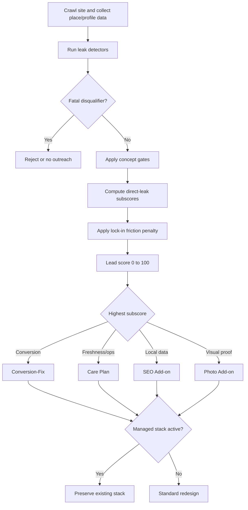

# Restaurant Revenue-Leak Rubric for Website Prospecting

## Executive summary

This rubric is designed to make restaurant prospecting evidence-led instead of opinion-led. It prioritizes the actions that restaurant discovery and booking stacks repeatedly emphasize: current menus, accurate hours, visible booking and ordering links, strong imagery, working local links, and fast, stable mobile experiences. The source base here is public documentation and research from entity["company","Google","search company"], entity["company","OpenTable","restaurant booking company"], entity["company","Toast","restaurant pos company"], entity["company","BentoBox","restaurant commerce company"], entity["company","SpotHopper","restaurant marketing company"], and entity["company","Resy","restaurant reservation company"], plus usability and trust research from entity["organization","Nielsen Norman Group","ux research firm"] and outreach data from entity["company","Gong","sales software company"] and entity["company","Clutch","b2b review platform"]. citeturn23view3turn23view4turn23view6turn23view8turn23view9turn23view10turn23view11turn23view15turn23view17turn22search0

For independent restaurants, the highest-signal “revenue leaks” are not subtle design flaws. They are direct failures in the owned path to intent: dead or broken domains, PDF-only or broken menus, missing or hidden reservation/order CTAs, incomplete or inconsistent Google profile data, mobile friction on action pages, and a site that fails to present existing reputation, photos, chef story, or event capability. Google explicitly tells restaurants to manage menus, photos, links, and hours in their Business Profiles; OpenTable, Toast, BentoBox, and Resy all frame the website as a direct booking or ordering surface; NNGroup shows that current, comprehensive content and design quality drive trust; and Clutch finds broken functionality and sloppy content visibly reduce trust. citeturn23view3turn23view4turn25view6turn25view7turn25view3turn25view4turn25view5turn23view15turn23view17

The practical implication for sales is to separate **direct leak severity** from **switching friction**. A broken menu page is a direct leak. An active Toast, OpenTable, BentoBox, SpotHopper, or Resy stack is usually not a leak by itself; it is a scope modifier telling you to sell a preserve-stack front-end refresh, care plan, or attribution/SEO cleanup instead of a blind rip-and-replace. For outreach, Gong’s current data supports short subject lines, short emails, and an “offer of value” CTA rather than a generic meeting ask. citeturn23view9turn23view10turn23view11turn23view8turn14search1turn14search7turn22search0

## Rubric design

Use this rubric only **after** a hard prospect gate for: independent ownership, open business, correct venue/entity, and category fit. Do not let a high leak score rescue obviously bad leads such as closed locations, chain-owned stores outside your ICP, or profiles that are not the actual venue.

For public prospects, use **Places API + public profile scrape + site crawl** as the default evidence stack. Save the Business Profile API for owned or authorized accounts. Google’s public Place Details fields can expose address, phone, website, hours, ratings, review counts, and restaurant attributes like `reservable` and `takeout`; the Business Profile API exposes fields like `websiteUri`, `regularHours`, and `specialHours` for managed accounts. Google also recommends Lighthouse/PageSpeed Insights for page quality audits. citeturn25view9turn37view0turn37view1turn37view2turn36view0turn36view1turn15search1

**Impact model legend**

| Model | Use when the leak affects | Formula | Conservative default assumptions |
|---|---|---|---|
| `R1` | Reservations | `sessions × click_lift × booking_completion × party_size × gross_profit_per_cover` | click lift `0.5–2.0%`; booking completion `20–50%` |
| `R2` | Direct online orders | `sessions × click_lift × checkout_completion × contribution_margin_per_order` | click lift `0.5–3.0%`; checkout completion `20–40%` |
| `R3` | Menu intent | `menu_sessions × recovery_rate × downstream_action_rate × action_value` | recovery `20–60%` |
| `R4` | Trust / consideration / visit intent | `sessions × bounce_reduction × downstream_action_rate × action_value` | bounce reduction `2–8%` |
| `R5` | Events, catering, private dining | `event_sessions × form_submit_lift × close_rate × avg_event_margin` | form lift `1–5%`; close rate `10–30%` |

These ranges are **heuristic prioritization proxies**, not guaranteed causal lifts. They are meant to help sales prioritize where to spend founder time.

**Applicability gates**

| Gate | How to infer it | Apply to |
|---|---|---|
| `reservable=true` | Place Details `reservable`, reservation widget/domain found, or reservation CTA exists | `V1`, `V5`, `I1` |
| `takeout=true` | Place Details `takeout`, order CTA exists, or concept is clearly order-led | `V2`, `I2` |
| `events_fit=true` | full-service concept, bar/wine/cocktail concept, private room clues, or events terms on social/profile | `V6`, `V8` |
| `reputation_bonus=true` | rating `>=4.4` and `userRatingCount >=100` | `C5`, photo/story add-on |
| `profile_access=owned` | authorized account access available | use Business Profile API directly instead of public scrape |

Applicable sources for these gates are public Google place/profile fields and restaurant attributes. citeturn37view0turn37view1turn36view1

## JSON schema

The schema below keeps each signal compact, machine-readable, and easy to score.

```json
{
  "$schema": "https://json-schema.org/draft/2020-12/schema",
  "title": "RestaurantRevenueLeakItem",
  "type": "object",
  "required": [
    "id",
    "category",
    "signal",
    "priority",
    "why",
    "fix",
    "impact_proxy",
    "detection",
    "difficulty",
    "false_positive_risk",
    "offer_hints"
  ],
  "properties": {
    "id": { "type": "string", "pattern": "^[A-Z][0-9]{1,2}$" },
    "category": {
      "type": "string",
      "enum": [
        "technical",
        "content_trust",
        "conversion_paths",
        "integrations_lockin",
        "data_hygiene"
      ]
    },
    "signal": { "type": "string" },
    "priority": { "type": "string", "enum": ["high", "medium", "low"] },
    "why": { "type": "string" },
    "fix": {
      "type": "object",
      "required": ["frontend", "backend"],
      "properties": {
        "frontend": { "type": "string" },
        "backend": { "type": "string" }
      }
    },
    "impact_proxy": {
      "type": "object",
      "required": ["model", "lift_range_pct", "formula"],
      "properties": {
        "model": { "type": "string", "enum": ["R1", "R2", "R3", "R4", "R5"] },
        "lift_range_pct": {
          "type": "array",
          "items": { "type": "number" },
          "minItems": 2,
          "maxItems": 2
        },
        "formula": { "type": "string" }
      }
    },
    "detection": {
      "type": "object",
      "required": ["method", "rule", "code"],
      "properties": {
        "method": {
          "type": "string",
          "enum": [
            "dom_css",
            "http",
            "places_api",
            "business_profile_api",
            "screenshot_ocr",
            "mobile_viewport",
            "link_check",
            "js_footprint"
          ]
        },
        "rule": { "type": "string" },
        "code": { "type": "string" }
      }
    },
    "difficulty": { "type": "string", "enum": ["easy", "medium", "hard"] },
    "false_positive_risk": { "type": "string", "enum": ["low", "medium", "high"] },
    "offer_hints": {
      "type": "array",
      "items": {
        "type": "string",
        "enum": ["conversion_fix", "care_plan", "seo_addon", "photo_addon", "preserve_stack"]
      }
    }
  }
}
```

```json
{
  "site": "https://example-restaurant.com",
  "applicability": {
    "reservable": true,
    "takeout": false,
    "events_fit": true
  },
  "signals_detected": ["V1", "C1", "D3"],
  "subscores": {
    "technical": 12,
    "content_trust": 19,
    "conversion_paths": 28,
    "data_hygiene": 17,
    "integrations_lockin": 8
  },
  "lead_score": 68,
  "primary_offer": "conversion_fix",
  "secondary_offers": ["seo_addon"],
  "sales_angle": "preserve_stack"
}
```

This structure aligns well with Google’s public place/profile fields and Lighthouse-style page audits. citeturn36view0turn36view1turn37view0turn37view1turn15search1

## Signal tables

Use these method abbreviations in the tables below: **DOM** = parsed HTML/CSS, **HTTP** = status/redirect checks, **GBP** = Google profile / Places API / Search-Maps scrape, **MV** = rendered mobile viewport test, **OCR** = screenshot/PDF text fallback, **JS** = script/iframe/event footprint inspection.

**Technical**

The thresholds below use Google’s Core Web Vitals defaults: LCP `<=2.5s`, INP `<=200ms`, CLS `<=0.1` at the 75th percentile. Google recommends Lighthouse/PageSpeed Insights for this style of auditing, and NNGroup’s touch-target guidance supports a roughly 40–44px minimum tap area on touch devices. citeturn31view0turn28view0turn28view1turn15search1turn23view16

| ID | Signal | Why it leaks | Fix | Pri | Impact proxy | Detection + code | Diff | FP |
|---|---|---|---|---|---|---|---|---|
| T1 | Mobile LCP `>2.5s` on home/menu/action pages | Main content feels “not ready”; users may bounce before menu/CTA appears | Optimize hero/media, preload fonts, reduce JS, SSR critical copy, cache/CDN | H | `R4`; `+0.5–1.5%` action rate | PSI/LH/CrUX; `if (lcp_ms > 2500) flag('T1')` | Easy | Low |
| T2 | INP `>200ms` on CTA/menu/widget interactions | Tap/click feels laggy; menu and booking interactions fail or delay | Code-split, defer nonessential scripts, reduce long tasks, lazy-load widgets | H | `R1/R2`; `+0.5–1.5%` completion | RUM/LH timespan; `if (inp_ms > 200) flag('T2')` | Med | Low |
| T3 | CLS `>0.1` in header/hero/widget area | The user aims at a button and it moves | Reserve widget/banner space; define image dimensions; avoid late inserts | H | `R1/R2`; `+0.3–1.0%` completion | LH/CrUX; `if (cls > 0.1) flag('T3')` | Easy | Low |
| T4 | Horizontal scroll or clipped blocks at `390×844` | Core actions or menu text become unreadable on mobile | Remove fixed widths; fluid type/grid; test 320/390/430 widths | H | `R3/R4`; recover `10–30%` of impacted mobile intent | MV + JS; `document.documentElement.scrollWidth > innerWidth + 1` | Easy | Med |
| T5 | Tap targets too small or sticky UI obscures actions | Hard to hit the money button cleanly | 44px+ buttons, safe-area padding, shorter header, sticky footer actions | H | `R1/R2`; `+0.3–0.8%` action | DOM/MV; `if (rect.w < 40 || rect.h < 40) flag('T5')` | Med | Med |
| T6 | Key links have 4xx/5xx, mixed content, or `>2` redirects | Direct path failure; visible trust damage | Repair URLs, canonicalize HTTPS, 301 once, add health checks | H | `R1/R2/R3`; recover `50–90%` of affected-path value | HTTP; `status>=400 || hops>2 || /http:\/\//.test(url)` | Easy | Low |

**Content & trust**

Google’s restaurant-profile guidance explicitly prioritizes menu content, menu URLs, photos, hours, and posts; complete and accurate profile data helps local discovery. Google’s photo guidance is concrete about resolution and image quality. NNGroup’s research supports weighting current, comprehensive content and design quality highly for trust, and it remains very clear that PDFs are poor digital UX. Resy/Bento also recommend a strong primary CTA, visible contact paths, high-quality imagery, alt text, and posting menu text even when a PDF exists. citeturn23view3turn23view6turn34view0turn35view0turn23view15turn23view14turn24view0turn24view2turn24view4turn24view5turn23view17

| ID | Signal | Why it leaks | Fix | Pri | Impact proxy | Detection + code | Diff | FP |
|---|---|---|---|---|---|---|---|---|
| C1 | PDF-only menu, no HTML text menu | PDF is weak mobile/search UX; diners get lost before choosing | Publish HTML menu with anchors; keep PDF only as print fallback | H | `R3`; recover `20–60%` menu-intent loss | DOM/OCR; `/\.pdf$/i.test(menuHref) && !htmlMenuTokens` | Easy | Low |
| C2 | Menu is stale or inconsistent across site/profile/provider | Wrong items or prices erode trust and waste visits | Single menu source of truth; sync site, provider, and schema | H | `R3/R4`; `+0.5–1.5%` action | DOM + GBP/provider diff; `if (diff(menuA, menuB) > threshold)` | Hard | Med |
| C3 | Hours or special hours missing/mismatched | Lost trips, wasted calls, holiday confusion | Shared hours source; special-hours update workflow | H | `R4`; recover `1–5%` local-intent value | DOM + Places/GBP; `if (!isEqual(siteHours, gbpHours)) flag('C3')` | Med | Med |
| C4 | Too few or low-quality food/interior/team photos | Site undersells the in-person experience | Add pro cover, food gallery, interior/team proof; compress and alt-text | M | `R4`; `+0.5–1.5%` action | DOM/GBP/OCR; `heroCount<1 || hiResImgs<4` | Med | Med |
| C5 | Strong Google rating/review count, but no proof on site | Reputation exists off-site but is absent where conversion happens | Add review strip, awards/press logos, chef story, trust module | H | `R4`; `+0.5–2.0%` action | Places + DOM; `rating>=4.4 && reviews>=100 && !proofBlock` | Easy | Low |
| C6 | Thin trust basics: no About/contact/address/phone | Site feels less legitimate and less local | Add footer NAP, About, contact path, parking/access notes | M | `R4`; `+0.3–1.0%` action | DOM/regex; `!tel && !address && !/about|contact/i.test(html)` | Easy | Low |
| C7 | Accessibility/text-equivalent gaps on core content | Some diners cannot consume images/menu content; trust drops | Alt text, text menu, focus states, accessibility contact | M | `R3/R4`; `+0.2–0.8%` action | Lighthouse/axe/DOM; `img:not([alt]), img[alt=""]` | Easy | Low |

**Conversion paths**

Resy/Bento’s restaurant-web guidance explicitly says the primary CTA should align to the restaurant’s top business goal, that the CTA should be visually distinct, and that contact forms and social links should capture non-immediate intent. OpenTable, Toast, Google profile links, and Toast Tables all support direct website and Google-based booking or ordering paths, so missing or hidden exposure of those actions is a genuine leak. NNGroup’s “link is a promise” principle supports descriptive CTA labels rather than generic filler copy. citeturn24view0turn24view1turn24view5turn23view8turn25view3turn25view4turn25view5turn25view6turn23view4turn23view5turn33search1turn33search3turn33search7

| ID | Signal | Why it leaks | Fix | Pri | Impact proxy | Detection + code | Diff | FP |
|---|---|---|---|---|---|---|---|---|
| V1 | No reservation CTA above fold on a reservable concept | Hides the primary money action | Add high-contrast `Reserve a Table` CTA; preserve existing widget/provider | H | `R1`; `+0.5–2.0%` click lift | DOM + MV; `!visibleAboveFold(/reserve|book table|reservation/i)` | Easy | Med |
| V2 | No order CTA above fold on an order-led concept | Off-premise demand leaks to marketplace or bounce | Add `Order Pickup` / `Order Delivery`; deep-link current provider | H | `R2`; `+0.5–3.0%` click lift | DOM + MV; `!visibleAboveFold(/order|pickup|delivery/i)` | Easy | Med |
| V3 | Menu is buried, broken, or opens the wrong artifact | Users cannot quickly evaluate food, pricing, or fit | Put menu in top nav; one click from home; section anchors; fix 404s | H | `R3`; recover `20–60%` menu intent | crawl + DOM + HTTP; `clickDepth('menu')>2 || menuStatus>=400` | Med | Low |
| V4 | Primary CTA label is vague (`Learn More`, `Get Started`) | Weak information scent lowers confident clicks | Use descriptive labels for the exact next action | M | `R1/R2/R3`; `+0.2–0.8%` click lift | DOM/regex; `/^(learn more|get started|click here)$/i` | Easy | Low |
| V5 | Existing provider capability is not surfaced on homepage | Booking/order exists, but guests do not see it | Expose current provider in hero/nav/sticky footer | H | `R1/R2`; `+0.5–1.5%` click lift | GBP/Search scrape + DOM; `providerInProfile && !providerOnSite` | Hard | Med |
| V6 | No private dining / events / catering path on a fit concept | High-margin intent has nowhere to go | Add inquiry form, event page, package request path | H | `R5`; form lift `1–5%` | DOM/regex; `!/(private dining|events|catering|group dining)/i.test(html)` | Easy | Med |
| V7 | No mobile quick actions for call / directions / hours | Ready-to-visit intent dies on the site | Sticky footer with Call, Directions, Hours, Reserve/Order | H | `R1/R4`; `+0.3–1.0%` action | DOM/MV; `!tel || !mapLink || !hoursSummary` | Easy | Low |
| V8 | No non-immediate intent capture | Visitors who are not ready now disappear forever | Add contact form, waitlist/newsletter, social links, event form | M | `R4/R5`; `+0.2–1.0%` later action | DOM/regex; `!form && !newsletter && socialLinks<2` | Easy | Med |

**Integrations & lock-in**

These rows are mainly **offer and scope modifiers**, not automatic reasons to disqualify a lead. Platform docs make clear that Toast, BentoBox, SpotHopper, OpenTable, and Resy often bundle websites with ordering, reservations, reviews, diner data, or marketing. The correct sales move is often “keep the engine, improve the front-end and conversion path.” The one exception below is marketplace-only ordering, which is a direct margin and ownership leak. citeturn23view7turn23view8turn23view9turn23view10turn23view11turn14search1turn14search7

| ID | Signal | Why it leaks | Fix | Pri | Impact proxy | Detection + code | Diff | FP |
|---|---|---|---|---|---|---|---|---|
| I1 | Reservation engine footprint active (`opentable`, `resy`, `toasttables`) | Not a direct leak; a bad migration can break a working revenue path | Preserve engine; improve placement, labels, copy, surrounding UX | M | close-rate modifier, not direct CVR | JS/DOM; `/opentable|resy|toasttables/i.test(srcsAndHrefs)` | Easy | Low |
| I2 | Ordering is marketplace-only (`DoorDash`, `Uber Eats`, `Grubhub`, `Slice`) with no first-party path | Margin and customer ownership leak to the marketplace | Add first-party order path; keep marketplace as secondary route | H | `R2`; move `10–30%` of order intent back to owned path | DOM/HTTP; `/doordash|ubereats|grubhub|slice/i && !firstPartyOrder` | Easy | Med |
| I3 | Managed site stack footprint active (`toasttab`, `getbento`, `spothopper`, `wix`, `squarespace`) | Scope and migration friction may be high | Lead with front-end refresh, component overlay, or care plan | M | close-rate modifier | JS/DOM/headers; `/toasttab|getbento|spothopper|wix|squarespace/i` | Easy | Med |
| I4 | CTA redirect chain is `>2` hops into provider/marketplace | Every hop adds drop-off and muddies attribution | Deep-link directly to the destination flow; reduce to one hop | M | `R1/R2`; recover `5–20%` redirected intent | HTTP; `follow(url).hops > 2` | Easy | Low |

**Data hygiene**

Google’s guidance is very clear that accurate, complete, current profile information helps customers know what a business does and when they can visit, and that complete profiles are more likely to show up in local search. Google also provides duplicate-profile and removal guidance for inaccurate or ineligible profiles. For machine-readable checks, the Business Profile API exposes website and hours fields for managed locations; Places exposes website, opening hours, ratings, review counts, and status fields. Schema.org supports `Restaurant`, `hasMenu`, opening hours, and reservation-related properties. Google’s menu policy also says menu URLs cannot be direct third-party ordering links. citeturn23view6turn25view10turn25view11turn25view12turn36view1turn37view0turn37view1turn38view0turn38view1turn32view0

| ID | Signal | Why it leaks | Fix | Pri | Impact proxy | Detection + code | Diff | FP |
|---|---|---|---|---|---|---|---|---|
| D1 | Dead / parked / expired domain or wrong canonical domain | Catastrophic loss of owned demand | Restore domain, renew DNS/SSL, 301 variants, fix canonical | H | `R1/R2/R3/R4`; recover `70–100%` owned traffic value | DNS/HTTP; `NXDOMAIN || parkedPattern || wrongCanonical` | Easy | Low |
| D2 | Closed, ineligible, duplicate, or name-mismatch profile | Searchers land on the wrong entity or a dead business | Request merge/removal, mark closed, verify correct profile | H | `R4`; recover local-intent traffic | GBP/Search/Places; `businessStatus!='OPERATIONAL' || duplicateLikely` | Hard | Med |
| D3 | Google profile missing website/menu/booking/order links | Action demand never reaches the owned or provider path | Add website, menu, booking, and food-ordering links correctly | H | `R1/R2/R3`; `+0.5–2.0%` action | GBP/Search scrape; `missingAny(['website','menu','booking','order'])` | Med | Low |
| D4 | NAP or hours mismatch across site, profile, and schema | Confuses users and weakens local trust/discovery | Sync one canonical business record across all surfaces | H | `R4`; recover `1–5%` local-intent value | DOM + schema + Places/GBP diff | Med | Med |
| D5 | Missing or invalid `Restaurant` / `LocalBusiness` / `Menu` schema | Search engines and AI systems get weaker structural signals | Add JSON-LD for location, hours, menu, sameAs, reservations where relevant | M | `R4`; local discovery proxy | DOM/JSON parse; `!hasSchemaType('Restaurant')` | Easy | Low |

## Scoring and offer mapping

The simplest robust scoring model is:

1. **Gate first**: reject closed, duplicate-only, chain/out-of-ICP, or wrong-entity leads.
2. **Score direct leaks**: technical + content/trust + conversion + data hygiene.
3. **Apply friction penalty**: active managed stacks reduce close probability or change scope.
4. **Map offers**: lead with the smallest credible fix that matches the detected leak mix.

This reflects how the cited platforms frame websites: menu, reservation, ordering, and profile links are the direct action surfaces; trust and current information support them; platform footprints change your delivery model more than they change diner demand. citeturn23view4turn23view5turn25view3turn25view4turn25view5turn23view15

```ts
type Priority = "high" | "medium" | "low";
type FPRisk = "low" | "medium" | "high";
type Category =
  | "technical"
  | "content_trust"
  | "conversion_paths"
  | "data_hygiene"
  | "integrations_lockin";

const BASE: Record<Priority, number> = { high: 12, medium: 7, low: 3 };
const FP: Record<FPRisk, number> = { low: 1.0, medium: 0.8, high: 0.6 };
const CAT: Record<Exclude<Category, "integrations_lockin">, number> = {
  technical: 1.0,
  content_trust: 0.9,
  conversion_paths: 1.2,
  data_hygiene: 1.1
};

function itemPoints(priority: Priority, fp: FPRisk, category: Category, evidence: "hard" | "soft") {
  const evidenceMult = evidence === "hard" ? 1.0 : 0.85;
  if (category === "integrations_lockin") return 0;
  return BASE[priority] * FP[fp] * CAT[category] * evidenceMult;
}

function leadScore(detections: any[], reputationBonus = 0) {
  let direct = 0;
  let friction = 0;

  for (const d of detections) {
    if (!d.applicable) continue;

    if (d.category === "integrations_lockin") {
      friction += BASE[d.priority] * FP[d.false_positive_risk] * 0.7;
      continue;
    }

    direct += itemPoints(d.priority, d.false_positive_risk, d.category, d.evidence);
  }

  return Math.max(0, Math.min(100, Math.round(direct - Math.min(20, friction) + reputationBonus)));
}
```

**Recommended thresholds**

| Tier | Rule | Meaning | Default motion |
|---|---|---|---|
| A | `lead_score >= 65` and `>=2` high-priority direct leaks | Strong cold-outreach target | Send audit + live prototype or Loom |
| B | `50–64` | Good target, but confirm fit manually | Send tighter issue-led email |
| C | `35–49` | Nurture or sell care/SEO/photo add-on first | Light-touch outreach |
| D | `<35` | Low priority | Skip or list-build only |

**Offer mapping**

| Condition | Primary offer | Secondary offers | Sales angle |
|---|---|---|---|
| `conversion_paths >= 22` or `T6/D1/V1/V2/V3` present | Conversion-Fix | SEO Add-on if `D3/D4/D5` | “We fixed the money path first.” |
| `content_trust + data_hygiene >= 20` and no catastrophic path break | Care Plan | SEO Add-on, Photo Add-on | “Your site looks okay but drifts out of date.” |
| `D3/D4/D5` heavy | SEO Add-on | Care Plan | “Your local discovery layer is leaking intent.” |
| `C4/C5` heavy and rating/review strength is high | Photo Add-on | Conversion-Fix | “Your reputation is stronger than your site.” |
| Any `I1` or `I3` present | Preserve-stack variant of the above | — | “Keep your current provider; improve the wrapper.” |



## Outreach and Loom assets

For cold outreach, keep the subject short, keep the email under about 100 words, anchor the message to a visible business problem, and make a concrete offer rather than asking for a vague meeting. That is the highest-confidence takeaway from Gong’s current executive cold-email data. citeturn22search0turn21search1

**Leak-triggered outreach snippets**

| Detected leak | Subject | One-line body | CTA |
|---|---|---|---|
| Dead domain / wrong canonical | `Domain issue` | I checked your site and one owned path appears broken, which can send Google and direct traffic nowhere. I mocked the fixed path. | `Open to a 60-sec preview?` |
| PDF-only menu | `Menu UX` | Your menu currently opens as a PDF, which is rough on mobile. I turned the same content into a faster HTML menu flow. | `Want the link?` |
| No reserve CTA above fold | `Reserve path` | Guests can reserve, but the action is not obvious in the first screen. I mocked a version that surfaces it without changing your provider. | `Should I send it over?` |
| No order CTA above fold | `Order leak` | Your online ordering path exists, but I couldn’t find a strong above-the-fold order action. I sketched a fix using the current stack. | `Worth a quick look?` |
| Hours mismatch | `Hours mismatch` | I found a mismatch between site hours and Google hours. That can create wasted visits and bad calls. I mapped the cleanup. | `Want the audit screenshot?` |
| Strong reviews, weak site proof | `Site undersells you` | You have strong public reviews, but the site barely shows that credibility. I mocked a simple proof section on the homepage. | `Want the before/after?` |
| No events/private dining path | `Private dining` | Your concept looks like a fit for events or group dining, but there’s no clear inquiry path. I put together a one-page fix. | `Open to seeing it?` |
| Managed stack detected | `Keep [provider], fix site` | I’m not proposing a platform rip-out. I mocked a front-end refresh that keeps your existing booking/ordering engine in place. | `Want the preserve-stack version?` |

**Annotated before/after screenshot overlay examples**

| Use case | “Before” overlay callouts | “After” overlay callouts |
|---|---|---|
| Homepage for a full-service restaurant | `1` red box around hero: “No Reserve CTA in first viewport”  • `2` amber box around menu link: “Opens PDF” • `3` red box around footer: “Phone/address hidden” • `4` amber box near top: “4.7★ rating not surfaced” | `1` green CTA: “Reserve a Table” • `2` green nav item: “Dinner Menu” • `3` green trust strip: “4.7★ on Google • chef/press proof” • `4` green sticky footer: “Call • Directions • Hours” |
| Menu page for a takeout-led concept | `1` red box: “Menu 404 / dead path” • `2` amber box: “Order CTA only in footer” • `3` red box: “Mobile overflow on categories” | `1` green tabs: “Pickup • Delivery • Catering” • `2` green category anchors: “Lunch • Dinner • Family Packs” • `3` green CTA rail: “Order Pickup” |
| Google profile / site mismatch | `1` red note on profile: “Hours differ from website” • `2` amber note: “Menu link missing” • `3` red note: “Website points to parked domain” | `1` green note: “Hours synced” • `2` green note: “Menu / booking / order links added” • `3` green note: “Canonical domain restored” |

**Sample Loom script**

> I took a quick look at your site and found two concrete places where guest intent is leaking. First, the menu path is harder than it should be on mobile, and second, the main action — reserve or order — is not obvious in the first screen. I also noticed your public reputation is stronger than what the site currently shows.  
>   
> I mocked a lightweight fix that keeps your current stack in place. The goal is not a platform rip-out. It’s to make the existing booking or ordering path easier to find, faster to load, and more credible.  
>   
> If this looks directionally right, I can send the live prototype link and a one-page scope with pricing.

That script works best when the video literally points to one or two visible failures and one preserved-stack fix, not a full design critique.

## Validation plan and limitations

Use a 10-site pilot before automating outreach at scale.

| Step | What to do | Success metric |
|---|---|---|
| Sample | Pick 10 independent restaurants across your target concepts: 5 obvious-problem sites, 5 decent controls | Balanced sample with varied stacks |
| Run | Crawl home, menu, contact, reserve/order page, and public Google profile | One JSON result per site |
| Label | Have one human reviewer score direct leak severity and best offer, blind to model score | Human rubric ready |
| Compare | Measure precision on high-priority signals and compare model score to reviewer rank order | `>=80%` precision on high-priority signals; score correlation visibly positive |
| Outreach smoke test | Send matched snippet to the top 5 scored sites only | A-tier reply rate higher than B/C tiers |
| Tune | Lower weights on noisy rows; raise weights on catastrophic direct leaks | False-positive rate on hard-edged rows stays low |

**Open questions / limitations**

The biggest implementation gap is public Google booking/order-link extraction. Places API exposes many useful fields, but not every Search/Maps action surface, so some rows will rely on public profile scraping rather than a stable API. Use that as a **medium-confidence** signal, not a hard gate. citeturn25view9turn37view0turn37view1

The impact bands are prioritization heuristics, not causal guarantees. They should be calibrated against your own prospects, close-won projects, and eventually client analytics. In practice, the best calibration loop is: detection precision first, then booked-call rate by score band, then close rate by offer type.

Finally, OCR should stay a fallback. Use it for image-based menus, flyers, or screenshots, but do not auto-send outreach based only on OCR evidence when the false-positive risk is high.