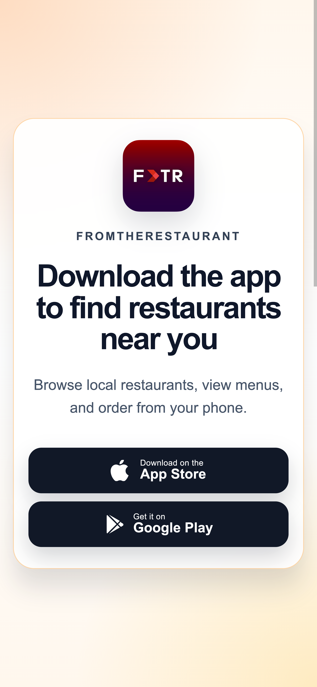

# Mary's Mexican Grill - Pre-Fork Audit

> **Current site tested locally:** http://www.marysmexicangrillil.com/  
> **HTTPS path tested locally:** https://www.marysmexicangrillil.com/ - failed with `curl: (35) OpenSSL/3.0.16: error:0A00010B:SSL routines::wrong version number` on 2026-05-01.  
> **Address:** 108 Cass St, Woodstock, IL 60098  
> **Phone conflict to resolve:** Restaurantji / Restaurant Guru / DoorDash ecosystem points to (815) 337-2303; indexed official-site copy points to (815) 923-5240.  
> **Run date:** 2026-05-01  
> **Skill:** `/Users/ethantalreja/skills/restaurant-website-audit/SKILL.md`

## Inputs Collected

- Current-site HTTP scrape stored at `scrapes/current-site-http.html`.
- Current-site HTTP headers stored at `scrapes/current-site-http-headers.txt`.
- Current-site HTTPS failure stored at `scrapes/current-site-https-error.txt`.
- Mobile and desktop screenshots of the successfully fetched current HTTP page stored in `screenshots/`.
- Restaurantji scrape stored at `scrapes/restaurantji.html`; visible public profile lists menu, hours, social links, photos, and reviews.
- Restaurantji public photo/menu assets downloaded for audit-only inventory into `screenshots/restaurantji-photo-wide.jpg`, `screenshots/restaurantji-photo-menu-grid.jpg`, and `screenshots/restaurantji-menu-wide.jpg`.
- External review/trust references checked: Restaurantji, Restaurant Guru, DoorDash, Roost scraped review snippets, and public search/crawler snippets for the official domain.
- Direct Google Maps reviews were captured in the OpenClaw browser on 2026-05-04 after clicking the **Highest rating** filter: `scrapes/google-reviews-highest-30.json`, `scrapes/google-reviews-highest-30.md`, `google-reviews-themes.md`, and `screenshots/google-reviews-highest-2026-05-04.png`.
- The captured Google packet contains 30 written 5-star reviews; no owner replies were visible in the captured set.

## TL;DR

Mary's is a strong lead because the restaurant has a healthy public reputation and enough visual/menu proof to make a good pitch, but the owned website path is in a broken operational state.

The best pitch is: **your public profiles say Mary's has 4.8-star taco, tamale, ceviche, guacamole, and service love on the Woodstock Square; your own domain currently says "finish setting up your online ordering," sends people to a vendor phone number, and fails over HTTPS.**

This should not be treated like a premium destination-dining fork. It wants a **casual Latin / Mexican, menu-first, order-ready site** with the restaurant name, hours, Cass Street location, menu, order path, and review proof in the first screen. Current catalog fit is `bamzi-01` hue-swap with some `pepper-01` conversion discipline; the better long-term answer is the dedicated Mexican / Latin casual template gap already noted in `template-inventory.md`.

---

## Block 1 - Verbatim Findings

| Field | Verbatim / Observed |
|---|---|
| Current platform / server | Static Apache page. HTTP headers show `Server: Apache/2.4.41 (Ubuntu)`, `HTTP/1.1 200 OK`, `Last-Modified: Sun, 29 Mar 2026 03:41:02 GMT`. |
| HTTPS state | Broken from local test: `wrong version number`. A normal guest entering `https://` can fail before seeing anything useful. |
| Live reliability | Curl succeeded after retry; one Playwright live screenshot attempt hit `net::ERR_CONNECTION_REFUSED`. Treat this as a reliability smell, not just a design problem. |
| Current page title | `Finish Setting Up Your Online Ordering`. |
| Visible brand on current site | `Fox Ordering`, not Mary's Mexican Grill. |
| Status pill | `Online ordering setup in progress`. |
| Hero / heading | `Call to finish setting up your online ordering`. |
| Hero subcopy | *"Your restaurant is almost ready to start taking direct online orders. Speak with our team to complete the final setup and go live."* |
| Primary CTA | `Call 866-883-6967`, linking to `tel:8668836967`. This is a vendor setup phone number, not a restaurant guest CTA. |
| Hours shown on current site | `Monday-Friday - Business hours`, apparently Fox Ordering support hours, not restaurant hours. |
| Setup steps shown | `Quick call`, `Final setup`, `Start taking orders`. |
| Restaurant address on current live HTTP page | Not present. |
| Restaurant phone on current live HTTP page | Not present. |
| Menu on current live HTTP page | Not present. |
| Order path on current live HTTP page | Not guest-usable; the only call path is setup support. |
| Photos on current live HTTP page | No restaurant food, interior, exterior, owner, staff, or menu photography. |
| Reviews on current live HTTP page | None. |
| Social links on current live HTTP page | None. |
| Public index conflict | Public search/crawler output still shows an older Mary's page with logo, address, hours, `Order Online`, and phone `(815) 923-5240`. That conflicts with the live local fetch and with aggregator phone data. |
| Restaurantji profile | Restaurantji lists Mary's at `108 Cass St`, phone `(815) 337-2303`, 4.8 rating from 254 ratings, Monday-Saturday 10AM-9PM, Sunday 10AM-8PM, menu/order links, Facebook/Instagram links, and photos. |
| Restaurant Guru profile | Restaurant Guru shows 556 votes, `#1 of 15 Mexican restaurants in Woodstock`, 46 photos, Google rating 4.8 from 526, and phone `+1 815-337-2303`. |
| DoorDash profile | DoorDash shows 4.7 from 100+ ratings, delivery/pickup, menu categories, and current order demand. |

### Browser Screenshots

- Current site desktop full page: `screenshots/current-site-desktop-full.png`
- Current site mobile full page: `screenshots/current-site-mobile-full.png`
- Current site mobile first viewport: `screenshots/current-site-mobile-fold.png`



### Mobile / Narrow-Viewport Failures

1. **The first viewport belongs to Fox Ordering, not Mary's.** On a 390 x 844 viewport, the guest sees `Fox Ordering`, an orange setup status pill, and a setup-support call button. There is no restaurant name, food, address, rating, menu, or open-state confidence.
2. **The only prominent tap target calls the wrong party.** The CTA is `Call 866-883-6967`, which is not the restaurant guest phone path.
3. **No high-intent restaurant actions exist.** A mobile guest cannot view a menu, order, call Mary's, get directions, check hours, or see the Woodstock Square location from the current page.
4. **HTTPS fails before the page loads.** If the guest or browser upgrades to HTTPS, the site can fail at connection time.
5. **Public NAP consistency is fractured.** The cached/indexed official copy shows `(815) 923-5240`; public restaurant profiles show `(815) 337-2303`. Before build, the owner needs to confirm the canonical number.

---

## Block 2 - Secret Sauce

Guests are not describing a mystery concept. They are describing a clean, comfortable Mexican grill on the Woodstock Square with strong tacos, tamales, guacamole, ceviche, sauces, tortillas, and friendly service. The rebuild should make the restaurant feel easy to choose tonight: nearby, open, affordable, orderable, and already loved.

### 1. Signature Dishes / Food Signals

- Restaurantji calls out burritos suiza, chilaquiles verdes with chicken, ceviche, homemade guacamole, red/green sauces, street tacos, pastor, and homemade tortillas.
- Restaurantji favorites include Camarones a La Mexicana, tacos de asada, tamales by the dozen, chicken chimichanga, enchiladas verdes, shrimp empanadas, and enchiladas suizas.
- Restaurant Guru calls out Mexican tacos, guacamole, steak fajitas, ice cream, and margaritas.
- DoorDash most-ordered signals include taco dinner, asada/steak, combo, burrito dinner, tacos, burritos suizos, chimichangas, antojitos, desserts, and drinks.
- DoorDash review snippets add delivery-proof around tamales, steak burritos, steak tacos, house salsa, fish tacos, shrimp tacos, and shrimp burritos.

### 2. Named Staff / Service

- Restaurantji includes a recent review saying the server Martha was "the best."
- Restaurant Guru includes a review praising Martha and naming chef Orfanel.
- Restaurant Guru also surfaces a review where the waitress was welcoming and attentive.
- DoorDash review snippets describe staff as genuinely kind and fast.

### 3. Vibe / Location

- Restaurantji describes the space as clean, comfortable, affordable, and in a lovely town-square setting.
- Roadtrippers/Yelp snippets reinforce the square location and casual neighborhood feel.
- The exterior photo inventory shows a Cass Street storefront with a clear awning and walkable downtown context.

### 4. Value / Takeout

- Restaurant Guru positions price per person around $10-$20.
- Roost review snippets repeatedly talk about good prices, portions, and food cooked to order.
- DoorDash's active profile proves there is already delivery/pickup demand; the owned site should capture the same intent before sending guests to a marketplace.

### 5. Bar / Occasion Signals

- Restaurant Guru mentions margaritas and a charming atmosphere.
- This is probably still a food-first casual Mexican grill, not a cocktail-led destination. Margaritas can support the page, but should not become the core register unless owner confirms alcohol/bar is a meaningful revenue path.

### 6. Owner / Family Story

- No verified owner name, founding story, or family/chef story surfaced in this pass.
- Roost snippets mention new ownership and a turnaround, but the audit should not turn that into brand copy until the owner confirms details.
- Build copy should ask for: owner names, whether Mary is an owner/family member/brand name, chef name, and whether there is a family recipe or regional origin story.

### Owner Voice - Verbatim Phrase Bank

Owner voice is thin. No owner replies were visible, and the current live owned page is vendor setup copy, not restaurant copy. These phrases should be treated as seed material only, not final brand voice.

```json
[
  { "phrase": "Welcome to Mary's Mexican Grill", "source": "indexed official-site copy", "tone": "warm/basic" },
  { "phrase": "Mexican restaurant", "source": "indexed official-site copy", "tone": "plain" },
  { "phrase": "Order Online", "source": "indexed official-site copy", "tone": "operational" },
  { "phrase": "Antojitos / Mexican Cravings", "source": "DoorDash merchant menu category", "tone": "specific/bilingual" },
  { "phrase": "Bebidas / Drinks", "source": "DoorDash merchant menu category", "tone": "bilingual/service" },
  { "phrase": "Camarones a La Mexicana", "source": "Restaurantji favorite/menu signal", "tone": "dish-specific" }
]
```

### External Trust Signals

```json
[
  {
    "source": "Restaurantji",
    "year": 2026,
    "claim": "4.8 rating from 254 ratings; public profile lists hours, address, phone, menu/order links, 25 photos, and social links.",
    "url": "https://www.restaurantji.com/il/woodstock/marys-mexican-grill-/"
  },
  {
    "source": "Restaurant Guru",
    "year": 2026,
    "claim": "#1 of 15 Mexican restaurants in Woodstock; 556 votes; 46 photos; Google rating shown as 4.8 from 526.",
    "url": "https://restaurantguru.com/Marys-Mexican-Grill-Woodstock-Illinois"
  },
  {
    "source": "DoorDash",
    "year": 2026,
    "claim": "4.7 rating from 100+ ratings, active pickup/delivery menu, and item-level demand signals for taco dinners, steak, burritos, chimichangas, antojitos, desserts, and drinks.",
    "url": "https://www.doordash.com/en/store/marys-mexican-grill-woodstock-28404782/"
  },
  {
    "source": "Roost scrape",
    "year": 2025,
    "claim": "Review snippets reinforce dine-in/takeout, tacos, tamales, fajitas, chimichangas, good prices, new-ownership turnaround, and Woodstock Square context.",
    "url": "https://www.roostcafeandbistro.com/marys-mexican-grill-60098/"
  }
]
```

Owner-response signal: no Google owner replies were observed. If replies exist, they should be collected before final copywriting because this audit currently lacks true owner voice.

---

## Block 3 - Per-Principle Violations

**Principle 1.1 - BROKEN conversion surface.** Mary's business model is menu/order/walk-in/takeout first. The current site does not let guests see food, browse a menu, order, call the restaurant, or get directions. It asks the restaurant to finish setup instead.

**Principle 1.3 - BROKEN menu-access relationship.** Public demand is dish-specific: tacos, tamales, ceviche, guacamole, shrimp, steak, burritos, chimichangas. The owned page has no menu surface, while DoorDash and Restaurantji carry the menu intent.

**Principle 2.3 - MISSING photography fidelity.** The current site has no restaurant photography at all. Public profiles show at least an exterior and plated food, but the owned site turns a visual cuisine into a generic setup page.

**Principle 3.1 - HIDDEN trust strategy.** Restaurantji, Restaurant Guru, and DoorDash all show strong public proof. The owned page surfaces none of it, so the highest-trust signals are stranded on third-party pages.

**Principle 4.2 - BROKEN hours signal.** The current site shows `Monday-Friday - Business hours`, apparently vendor support hours. Restaurantji shows Mary's daily restaurant hours, but the owned site does not.

**Principle 4.3 - BROKEN phone vs. widget routing.** The most prominent phone CTA calls Fox Ordering at 866-883-6967. Public restaurant profiles show `(815) 337-2303`, while indexed official copy shows `(815) 923-5240`. This is a conversion and NAP trust problem.

**Principle 5.1 - BROKEN first-viewport floor.** The first viewport does not establish name, cuisine, neighborhood, open state, rating, menu, order, phone, or directions. It establishes only vendor setup status.

**Principle 5.2 - PHOTO-TIER CONSTRAINED.** The audit found public visual evidence, but not a production-ready owner-owned gallery. A new site can be mocked, but the final build needs owner-supplied food/exterior photos to avoid a generic Latin template skin.

**Principle 5.3 - WEAK copy / missing specificity.** The public story is specific: Cass Street, Woodstock Square, tacos, ceviche, tamales, guacamole, sauces, friendly service. The current live owned page is generic SaaS setup copy.

**Principle 5.4 - BROKEN mobile.** On mobile, the page is readable, but it is the wrong page. The failure is not layout polish; it is business meaning. The screenshot shows a polished vendor setup screen in place of a restaurant website.

**Principle 8, anti-pattern 3 - BROKEN generic positioning.** "Finish setting up your online ordering" could belong to any restaurant. It erases the exact things guests already praise about Mary's.

**Principle 8, anti-pattern 8 - BROKEN outsourced conversion path.** Third-party profiles and DoorDash are doing the work the owned site should do: menu, proof, photos, hours, and ordering.

**Principle 10 - DEAD aliveness layer.** No live open status, updated menu stamp, review wall, map embed, social freshness, seasonal specials, or order-state confidence appears on the owned page.

---

## Block 4 - So Why Are We Rebuilding It?

1. **The current owned path actively misroutes guests.** A guest looking for Mary's gets a vendor setup page and a vendor phone number. The rebuild turns the first screen into a real guest path: menu, order, call, directions, hours.
2. **The public proof is strong but not owned.** Restaurantji and Restaurant Guru show 4.8-level reputation; DoorDash shows active order demand. The site should surface that trust before the customer leaves.
3. **The dishes already have hooks.** Tacos, ceviche, tamales, guacamole, sauces, steak, shrimp, and chimichangas give the page concrete content. The rebuild can stop sounding generic immediately.
4. **The mobile failure is pitch-visible.** The screenshot is simple for an owner to understand: the phone currently says Fox Ordering, not Mary's.
5. **The technical fix and design fix are the same business fix.** Fix HTTPS, fix NAP, restore canonical ordering, and lead with the restaurant's actual food and location.

Pitch sentence: **Mary's already has the tacos, tamales, ceviche, guacamole, Martha-level service praise, and 4.8-star public proof; the rebuild makes the first tap say "Mary's Mexican Grill on Cass Street" instead of "finish setting up your online ordering."**

### Hero Lock

```json
{
  "wordmark": "Mary's Mexican Grill",
  "eyebrow": "Mexican grill on Woodstock Square",
  "sub": "Tacos, tamales, ceviche, guacamole, and 4.8-star local proof on Cass Street.",
  "hero_photo_subject": "Owner-supplied bright hero photo of taco dinner / pastor tacos / ceviche on a real Mary's table; audit-only fallback reference is the Restaurantji collage showing Cass Street exterior plus plated tacos and rice.",
  "cta_primary": {
    "label": "View Menu",
    "action": "scroll to HTML menu sections"
  },
  "cta_secondary": {
    "label": "Order Online",
    "action": "open direct online ordering once Fox Ordering is live and verified"
  },
  "rationale": "Drawn from Restaurantji's dish praise, Restaurant Guru's 4.8 Google proof, DoorDash's active order demand, and the current mobile screenshot showing the wrong first tap."
}
```

---

## Block 5 - Risks Before Fork

### Photography Inventory + Tier Gate

| Source | Dish shots | Interior shots | Chef portrait | Exterior | Detail / process |
|---|---:|---:|---:|---:|---:|
| Current owned live HTTP page | 0 | 0 | 0 | 0 | 0 |
| Indexed/cached official copy | Food images are referenced by crawler, but not captured locally in the live HTTP page | unknown | 0 | unknown | 0 |
| Restaurantji | At least 2 plated-food panels in downloaded collage; profile says 25 photos | unknown | 0 | 1 clear exterior panel | 2 menu image assets |
| Restaurant Guru | Page says 46 photos across food/exterior/interior/drink | unknown | unknown | yes, by category label | unknown |
| DoorDash | Menu item/order imagery may exist, but not inventoried for production rights | 0 | 0 | 0 | menu/order data only |
| Facebook / Instagram | Links exist from Restaurantji; not fully scraped in this pass | unknown | unknown | unknown | unknown |
| Owner-supplied | 0 | 0 | 0 | 0 | 0 |
| **Total production-usable** | **Unknown / not licensed** | **Unknown** | **0** | **Unknown** | **Unknown** |

**Photography verdict:** Tier-3 concept is plausible, but production is **not photo-ready** until the owner provides 8-12 bright, usable shots. Public aggregator photos are useful for audit and mood, not a safe production asset pool. Tier-1 and Tier-2 templates are blocked.

Minimum owner photo ask:

- Exterior / awning on Cass Street.
- 5-7 signature dishes: tacos de asada, pastor, ceviche, tamales, enchiladas verdes/suizas, guacamole/salsas, shrimp or steak plate.
- 1-2 room/table shots.
- 1 staff or owner photo if they want warmth/story.
- Menu photos or source menu text with current prices.

### Register Risk

Mary's should not be oversold as upscale, chef-driven, or destination fine dining. The review language points to affordable, friendly, local, clean, and food-satisfying. The correct register is **casual Mexican grill with strong order/menu conversion**.

### Template Hypothesis

Recommended immediate route: **`bamzi-01` hue-swap**, constrained down to casual Latin/Mexican and paired with `pepper-01`'s menu/order discipline. Use saturated food color, strong display wordmark, visible review proof, menu cards, order CTA, sticky mobile actions, and a simple directions/hours band.

Do not use:

- `1776-redesign-01`, `alinea-01`, `qitchen-01`, `varro-01`, or `labrisa-01`: too premium for the restaurant and blocked by photo tier.
- `gusto-01`: too heritage Italian/trattoria-coded.
- `plate-01` only if `bamzi-01` cannot be adapted cleanly; it risks becoming too generic.

Longer-term ideal: dedicated Mexican / Latin saturated-vibrant template, which `template-inventory.md` already marks as the next highest-priority catalog gap.

### Owner-Emotional Risk

This pitch should be framed as rescue, not critique: "your reputation is strong; the domain is not carrying it." The owner may not know the site is showing a setup page or may believe online ordering is still in progress. Lead with screenshot evidence and the mismatch against 4.8 public proof.

### Data Unknowns

- Confirm canonical phone: `(815) 337-2303` vs `(815) 923-5240`.
- Confirm final ordering platform and whether Fox Ordering is intended to be used.
- Confirm current hours; Restaurantji and indexed official copy differ on Sunday closing time.
- Confirm owner name, Mary story, chef name, and whether Orfanel is still relevant.
- Confirm whether they want DoorDash linked, direct ordering linked, or both.

### Reservation / Ordering Decision

No reservation platform is needed unless the owner says dine-in reservations matter. Primary conversion should be **View Menu -> Order Online / Call / Directions**. Direct ordering should be preferred over marketplace ordering if Fox Ordering can be completed and SSL/NAP are fixed.

### Status Footer

**Qualified pre-fork:** yes, with a hard D1/V2/V3 website failure. **Recommended template hypothesis:** `bamzi-01` hue-swap with `pepper-01`-style order/menu sections; Tier-3 photo gate pending. **Pre-flight asks:** canonical phone, current hours, direct ordering URL/status, current menu/prices, 8-12 owner-approved photos, owner/chef story.
