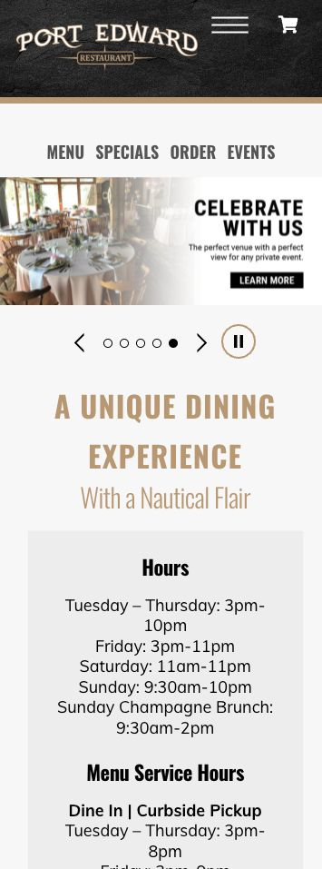
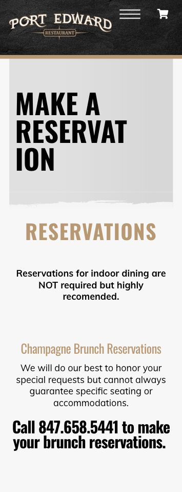
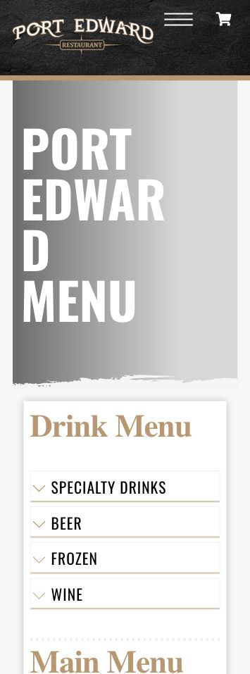

# Port Edward Restaurant - Strategic Site Audit

> **Lead source:** [next-5-mchenry-county-audits-2026-04-28.md](../../research/lead-qualification/next-5-mchenry-county-audits-2026-04-28.md) #3.
> **Pre-fork qualification:** Conditional build. Strategically attractive seafood / private-events slot, but reputation proof must be handled carefully.
>
> **Address:** 20 W. Algonquin Rd., Algonquin, IL 60102
> **Phone:** (847) 658-5441
> **Current site:** [portedward.com](https://portedward.com/)
> **Google listing:** 4.2 / 2,278 reviews / $$$ / seafood restaurant, captured 2026-04-30 after selecting `Highest rating` in Google Maps reviews.
> **Primary revenue streams visible:** dine-in seafood, Sunday champagne brunch, surf-and-turf buffet, Dockside / patio, Toast takeout, private events, ticketed events, gift cards, loyalty signup.
> **Decision:** BUILD on `labrisa-01`, adapted away from French Riviera polish and toward Fox River heritage seafood + multi-service private-event routing.
> **Framework:** [restaurant-website-strategic-principles.md](../../research/restaurant-website-strategic-principles.md)
> **Review packet:** [google-review-packet.md](./google-review-packet.md)

---

## Block 1 - What The Current Site Actually Does

| Element | Current state |
|---|---|
| Platform | WordPress on Bluehost / Apache, Themify Ultra builder, WooCommerce cart/checkout, The Events Calendar, MonsterInsights, Jetpack Open Graph. |
| Page title | *"Port Edward Restaurant - A Unique Dining Experience - Since 1964"* |
| Hero / first screen | Mobile first paint starts with logo, `Menu`, `Cart`, a top navigation row, then a rotating image-slider surface for Champagne Brunch, Surf & Turf, specials, entertainment, and private events. |
| Current positioning | *"A UNIQUE DINING EXPERIENCE"* and *"With a Nautical Flair"* sit below the slider rather than acting as the first clear decision sentence. |
| Primary CTAs | Homepage top nav: Menu, Specials, Order, Events. Mid-page: Toast order, View Menu, View Specials, Private Events, event links, loyalty signup, email signup, reservation details. |
| Ordering | Toast link: `https://www.toasttab.com/port-edward-restaurant/v3` |
| Reservations | Phone-first. Homepage event cards and `/reservations/` use `tel:847-658-5441`; no visible OpenTable / Resy / Tock widget. |
| Reservation page | Says indoor-dining reservations are recommended, brunch reservations are by phone, holiday reservations require deposit, and Porpoise/Windmill reservations require call or visit. |
| Menu access | `/menu/` is HTML, not PDF-only. It has anchor links and accordion sections, but mobile first view shows a long category index before actual dishes. |
| Menu depth | Real menu content exists in page HTML: cocktails, beer, wine, appetizers, soups/salads, sandwiches, oysters/mussels, bowls, seafood, steaks/chops/poultry, sides, desserts, kids. |
| Signature menu examples | Calamari, seafood stuffed mushrooms, Maryland crab cakes, Port Platter, lobster bisque, lobster roll, grouper, jumbo scallops, walleye, Alaskan king crab legs, Gifts of the Sea pasta, Lobster Edwardo, surf-and-turf add-ons. |
| Hours | Homepage and footer list general hours plus separate menu-service hours. Google listed Closed / Opens 3 PM during capture. |
| Address / phone | In Google listing, footer, and contact surfaces. Footer includes address, phone, and `info@portedward.com`. |
| Events | Current homepage listed Spring Wine Tasting on April 30, Surf & Turf Buffet on May 1, and Mother's Day Brunch on May 10. Events API exposed recurring live entertainment and buffet/brunch events. |
| Private events | `/private-events/` lists Topside up to 50, Mermaid Room up to 70, Regency up to 80, and a Cynthia phone/contact-form path. |
| Brunch | `/champagne-brunch/` positions Sunday brunch as "60 year famous" and lists classic brunch, holiday brunch, seafood station, smoked fish station, pricing, and crab-leg add-on. |
| Dockside | `/dockside/` currently says closed for the season and reopens Memorial Day Weekend. |
| Social | Footer links Facebook, Instagram, TikTok, and YouTube. |
| Schema | Themify emits WebSite + WebPage JSON-LD only. No complete `Restaurant` / `LocalBusiness` JSON-LD with address, hours, menu, ordering, reservations, events, or aggregate rating detected on homepage. |

### Mobile State

Screenshots captured in the in-app browser at a narrow mobile viewport and saved under `mobile-failures/`.

1. **Home first paint is a utility-and-slider stack, not a decision surface.**
   Screenshot: 
   The first screen is logo, menu/cart chrome, navigation, and slider artwork. The clear commercial choices (reserve, brunch, dockside, events, Toast order, private events) are split across multiple rows and later sections.

2. **Reservation flow is phone-only and text-heavy.**
   Screenshot: 
   A mobile guest reaches a reservation page that explains rules and call instructions, but there is no booking widget, no availability signal, and no segmented choice between dining, brunch, holiday, Porpoise/Windmill, and private events.

3. **Menu page is technically crawlable but mobile-scanning is slow.**
   Screenshot: 
   The first menu viewport shows category links and a spacer before the user sees dishes. Good content exists, but the phone user has to jump through accordions/anchors to get to the seafood proof.

4. **Hours are present, but not converted into aliveness.**
   The site lists hours and menu-service hours, but it does not answer "open now?", "brunch today?", or "Dockside open?" in a live, first-screen way.

5. **Cookie popup appears before the restaurant is understood.**
   First visit showed a cookie/privacy panel before content. It can be closed, but it still commits Principle 8 anti-pattern #4 in the first-contact moment.

---

## Block 2 - Secret Sauce From Reviews

Port Edward's strongest guest-loved asset is not a single dish or a single rating. It is a whole memory system: the Fox River, the indoor boat / fish / windmill room, Sunday and holiday brunch, seafood abundance, named staff warmth, and owner Z carrying forward Mr. Ed's strange, beloved, riverfront institution. The rebuild should feel like a clearer front door to those experiences, not a glossy seafood template pasted over them.

### Water, Dockside, And The Room

Guests repeatedly describe the Fox River view, patio/outdoor seating, and the bar facing the water as reasons to visit. Inside, the highest-rated reviews keep pointing to the nautical room itself: fish pond, boat, windmill, marine theme, and the feeling of being in a real port. This is why a generic plate-only seafood hero would undersell them.

Review-derived signals:

- Fox River backdrop and right-on-the-water seating.
- Indoor fish/water feature and koi/fish moment.
- Boat, windmill, marine decor, old Sea World / port atmosphere.
- Quiet lunch and bigger occasion dinner both supported.

### Brunch, Buffet, And Holidays

The Google highest-rating pass confirms brunch and buffet as true product lines, not side pages. Sunday champagne brunch, Thanksgiving brunch, Christmas Eve surf-and-turf, holiday brunch, oysters, gravlax, seafood stations, bread pudding, bananas foster, and dessert variety all recur. The brunch path should be a first-class service surface.

Review-derived signals:

- Sunday and holiday brunch are occasion drivers.
- Surf-and-turf buffet and champagne are strong review topics.
- Families use Port Edward for holidays and special days.

### Seafood Signatures

The site has the menu depth to back the reputation. Review and menu overlap is strong around cod sandwich, scallops, grouper, crab cakes, king crab legs, walleye, lobster, oysters, shrimp, and Port Platter. This is a seafood-institution pitch, not only a waterfront-patio pitch.

Menu/review overlap:

- Cod sandwich, crab cakes, tuna wonton, grouper, scallops, walleye.
- Lobster roll, lobster tails, king crab legs, oysters, surf-and-turf.
- Port Platter as a nameable house item.

### Named People And Hospitality

The review pass surfaced named staff and owner proof: John, Frankie, Michael, Samantha, Doug, Miss Cheryl, and owner Z. Service language is warm, attentive, quick, professional, welcoming, and family-friendly. One birthday review specifically turns Z and the koi fish into a story.

This is the emotional switch reason: the current site talks about a venue, but guests talk about people.

### Heritage And Founder Story

External press and the current About page give Port Edward unusually strong story material:

- Founded by Edward Wolowiec in 1964.
- Built from a small waterfront bar into a landmark seafood restaurant.
- Mr. Ed's artifacts, the Porpoise boat, the windmill, old-building wood, and repurposed objects are all real story assets.
- Ziya "Z" Senturk now carries the legacy forward after Wolowiec's 2022 death.
- The 2024 remodel brightened the room while preserving the core artifacts.

### Occasions

The site should explicitly route occasions:

- Anniversary brunch.
- Birthday dinner with kids.
- Thanksgiving / Christmas Eve / Easter / Mother's Day / Father's Day brunch.
- Summer patio / Dockside.
- Private-event rooms.
- Wine tastings and live music.

### Owner Voice - Verbatim Phrase Bank

```
[
  { phrase: "Welcome aboard!", source: "current About page", tone: "warm / nautical" },
  { phrase: "make yourself at home", source: "current About page", tone: "warm" },
  { phrase: "come aboard", source: "current About page", tone: "playful / nautical" },
  { phrase: "Ziya's Port Edward", source: "Shaw Local 2024 feature", tone: "legacy / specific" },
  { phrase: "guest to our house", source: "Ziya Senturk quoted by Shaw Local 2024", tone: "hospitality" },
  { phrase: "What would Edward think", source: "Shaw Local 2024 feature", tone: "heritage / guiding principle" },
  { phrase: "The pleasure of the company we keep", source: "founder bio on current About page", tone: "warm / family" },
  { phrase: "Thank you", source: "visible Google owner reply fragment", tone: "brief / appreciative" }
]
```

Use map:

- Hero sub: "Welcome aboard" only if the design can carry it without theme-park energy.
- About: Ziya carrying Mr. Ed's legacy; "guest to our house" as hospitality spine.
- Footer / 404: "The pleasure of the company we keep" is a better closer than generic seafood copy.
- Reservation module: "come aboard" works for Porpoise / Windmill specialty seating if handled lightly.

### External Trust Signals

```
[
  {
    source: "Village of Algonquin proclamation",
    year: 2024,
    claim: "Commended Port Edward for 60 years in Algonquin; cited Best of the Fox, Zagat, Five Forks from Check, Please!, and AAA's unusual-restaurant recognition.",
    url: "https://www.algonquin.org/egov/documents/1718378848_6683.pdf"
  },
  {
    source: "Shaw Local",
    year: 2024,
    claim: "Feature on Port Edward's new era, Ziya Senturk's ownership, the remodel, and preserving Edward Wolowiec's legacy.",
    url: "https://www.shawlocal.com/thescene/2024/04/15/iconic-port-edward-restaurant-in-algonquin-sails-into-new-era-60-years-after-opening/"
  },
  {
    source: "Shaw Local / Northwest Herald",
    year: 2022,
    claim: "Founder obituary confirms Wolowiec's music/art/travel background, 1964 opening, the 25-foot Porpoise sailboat, reclaimed materials, and multigenerational celebrations.",
    url: "https://www.shawlocal.com/northwest-herald/news/2022/12/14/port-edward-restaurants-founder-the-renaissance-man-dies-at-92/"
  },
  {
    source: "Daily Herald",
    year: 2016,
    claim: "Included Port Edward in a feature on unique suburban dining experiences; highlighted the indoor boat, nautical theme, seafood menu, and Sunday champagne brunch.",
    url: "https://www.dailyherald.com/20160101/lifestyle/4-unique-suburban-dining-experiences-to-try-in-2016/"
  },
  {
    source: "Lake & Country Magazine",
    year: 2021,
    claim: "Named Port Edward Best Waterfront Dining; cited Fox River setting, since-1964 seafood, wine cellar, live music, patio, and dockside dining.",
    url: "https://www.lakeandcountrymagazine.com/uncategorized/best-of-the-best/best-of-restaurants/"
  },
  {
    source: "Google Maps",
    year: 2026,
    claim: "4.2 rating, 2,278 reviews, 1,426 five-star reviews; review topics include river view, buffet, outdoor seating, champagne, lobster roll, live music, crab legs.",
    url: "https://www.google.com/maps/place/Port+Edward+Restaurant/"
  },
  {
    source: "Tripadvisor",
    year: 2026,
    claim: "3.7 from 249 reviews; #9 of 121 Algonquin restaurants; American / Seafood / International; features include brunch, outdoor seating, reservations, live music, full bar, wine/beer.",
    url: "https://www.tripadvisor.com/Restaurant_Review-g29247-d525165-Reviews-Port_Edward_Restaurant-Algonquin_Illinois.html"
  }
]
```

Owner-response signal: visible but weak in capture. One Google reply fragment appeared under D Jones; no broad reply cadence captured. The site and press provide enough owner voice to proceed, but a pre-pitch Google owner-reply check is still worth doing.

---

## Block 3 - Where It Breaks The Strategic Principles

**Principle 1.1 - Conversion surface matches revenue reality: BROKEN.** Port Edward is a multi-stream restaurant: dine-in, brunch, buffet, Dockside, Toast takeout, private events, ticketed events, loyalty, and gift cards. The current homepage gives all of those equal-ish utility weight across a nav row, slider, cards, and footer. `labrisa-01` is the better business-shape because it can make these streams legible as service choices.

**Principle 1.2 - Aesthetic must match the bill: MIXED.** Google marks the business $$$, the menu supports seafood/steak/brunch/event pricing, and the venue has 60-year institution proof. But the mobile first impression is a compressed WordPress utility stack rather than a $50-100 occasion venue. It under-signals the value of the room and over-signals "busy old website."

**Principle 1.3 - Menu access friction: PARTIAL.** The menu is not PDF-only, which is good. But the phone view presents a category index and decorative/menu images before the dish proof. A user looking for walleye, scallops, crab legs, or brunch seafood has to work too hard to find the reasons people praise the place.

**Principle 2.3 / 5.2 - Photography fidelity: CONSTRAINING.** The current media library is abundant, but much of it is event-flyer artwork, menu graphics, and functional room shots. There are usable interior/Dockside/room photos, but not yet a clean Tier-1 seafood-institution set with dish, owner, deck, river, and detail images all graded consistently.

**Principle 3.1 - Trust strategy: HIDDEN.** Google shows 2,278 reviews, the Village recognized 60 years, Shaw Local published a rich new-era story, and the founder story is unusually strong. The homepage mostly asks users to interpret sliders and utility cards instead of giving them a trust narrative.

**Principle 3.2 - Since YYYY: PRESENT BUT UNDERUSED.** The title and About page carry since-1964 heritage, but it is not used as a first-screen stamp with the river, founder, and Z story. A 60-year mark should be a front-door signal.

**Principle 4.1 - Sub-page count reveals operational complexity: TOO FRAGMENTED.** Port Edward has real operational complexity, so multiple pages are justified. The problem is that the pages are not arranged as a clear service router. Brunch, Dockside, events, private events, menu, ordering, reservations, loyalty, and gift cards compete instead of laddering.

**Principle 4.3 - Phone-first vs widget-first: ACCEPTABLE BUT INCOMPLETE.** A heritage seafood institution can keep phone reservations. But mobile users still need a modern chooser: dinner, brunch, holiday brunch, Porpoise/Windmill, Dockside, private event. The current reservation page is a text notice, not a conversion surface.

**Principle 5.1 - First-viewport conversion floor: WEAK.** Brand is visible, but positioning, primary CTA, and a register-defining photo/choice are muddied by the slider and multiple equal actions. The customer should know "Fox River seafood since 1964, choose dinner/brunch/events/order" immediately.

**Principle 5.3 - Copy specificity: UNDERLEVERAGED.** The best language is buried in About and press: Mr. Ed, Ziya, Porpoise, windmill, Fox River, four generations, Dockside, brunch, surf-and-turf. The homepage uses broader utility and event graphics when it could be specific.

**Principle 5.4 - Mobile is where booking happens: BELOW FLOOR.** Reservation is phone-only, CTA hierarchy is not first-screen clear, menu scanning begins with anchors, and the cookie banner can interrupt first contact. The mobile experience contains the right links but not the right order.

**Principle 5.5 - Repeat-customer architecture: PRESENT BUT SCATTERED.** Events, loyalty, email signup, Dockside seasonality, live music, and recurring buffets are all there. The rebuild should not invent aliveness; it should organize the aliveness they already have.

**Part 8 anti-pattern #1 / #2 - Hero slider as positioning: COMMITTED.** The rotating slider tries to sell brunch, buffet, specials, entertainment, and private events before the site establishes why Port Edward is special.

**Part 8 anti-pattern #4 - Cookie popup before hero: COMMITTED.** The privacy panel appears before the mobile user understands the restaurant.

**Part 8 anti-pattern #7 - Vague awards: PARTIAL.** The About page references awards, but the first screen does not name current, source-specific proof. The audit should use the Village proclamation and press strip instead of vague "award-winning" copy.

**Part 10 - Aliveness: MISSED STRUCTURE.** Port Edward has events and seasonal services, but no `LiveOpenStatus`, no live Dockside open/closed context, no first-screen current event selector, and no interactive map. The data is alive; the presentation feels static.

---

## Block 4 - So Why Are We Rebuilding It?

1. **The current site has all the revenue streams but makes guests assemble them manually.** Guests already come for brunch, surf-and-turf buffet, seafood dinner, Dockside, live music, and private rooms. A `labrisa-01` fork can make those choices visible in one multi-service selector instead of a slider/nav maze.

2. **The Google review packet says the room is the product, but the first screen does not sell the room.** Reviewers talk about the Fox River, boat, fish pond, windmill, patio, and "real port" atmosphere. The new site should lead with a river / room / Dockside visual, not a generic rotating promo surface.

3. **The founder-and-Z story is conversion-grade proof.** The site has the facts, and Shaw Local gives the handoff: Mr. Ed built the landmark; Ziya "Z" Senturk is carrying it forward. That story should sit beside the 60-year proof and reservation choices.

4. **The reservation path needs modern routing while preserving phone habits.** Phone stays. But dinner, brunch, holiday brunch, Porpoise/Windmill, Dockside, and private events need distinct cards so the guest knows why they are calling and what they are asking for.

5. **The menu is strong enough to be searchable and sell itself earlier.** Scallops, walleye, crab legs, Lobster Edwardo, lobster bisque, Port Platter, surf-and-turf, and Sunday brunch seafood should become page-native proof blocks, not buried accordion content.

6. **The site already has repeat-visit engines.** Events, live entertainment, loyalty, gift cards, Dockside reopening, and email signup should become a clean "what's happening now" layer rather than a set of scattered utilities.

**Pitch sentence:** *"Port Edward already has what most restaurants wish they had: the Fox River, Mr. Ed's 1964 story, Z carrying the legacy forward, Sunday champagne brunch, Dockside, and rooms people remember. I rebuilt the homepage so guests can choose dinner, brunch, Dockside, private events, or Toast ordering without sorting through a busy WordPress stack."*

### Hero Lock

```
{
  wordmark: "PORT EDWARD",
  eyebrow: "Fox River seafood since 1964",
  sub: "Welcome aboard Ziya's Port Edward: brunch, Dockside, private rooms, and seafood memories on the river.",
  hero_photo_subject: "Fox River / Dockside exterior with water and restaurant visible; fallback: interior Porpoise / fish pond / windmill room; fallback 2: seafood spread with river or nautical room context.",
  cta_primary: { label: "Plan Your Visit", action: "open multi-service selector for dinner, brunch, Dockside, events, private rooms" },
  cta_secondary: { label: "Order Online", action: "open Toast ordering link" },
  rationale: "Drawn from Google review themes around the river, brunch, and named owner/staff warmth; supported by the 1964 founder story and the current site's nautical voice."
}
```

---

## Block 5 - Risks Before Fork

### Photography Inventory + Tier Gate

| Source | Dish shots | Interior shots | Chef / owner portrait | Exterior / river | Detail / process |
|---|---:|---:|---:|---:|---:|
| Current site / WordPress media | 20+ menu/specials graphics and some dish photos; many are event flyers rather than natural food photos | 25+ room/venue images from 2025 media, including waiting area, secret room, Sea Shanty, Salem Lounge, Porpoise, deck, Windmill, Waldorf, host stand | 0 confirmed in media list; press has owner/founder photos | 10+ Dockside/deck/entrance/river-adjacent assets | Low; mostly promotional/event graphics |
| Google Maps photos | Abundant user photos; visible review batch included food, patio, room, and event/buffet photos | Strong volume but mixed phone quality | Owner Z appears in review text, not confirmed as usable image | Strong exterior/patio/river signal | Mixed user-shot quality |
| Instagram | Official account linked as `@portedwardrestaurant`; feed not scraped in this pass | Unknown | Unknown | Unknown | Unknown |
| Facebook | Official page linked; not scraped in this pass | Unknown | Unknown | Unknown | Unknown |
| Owner-supplied | Unknown | Unknown | Unknown | Unknown | Unknown |
| **Total usable now** | **Tier-2-ish quantity, mixed consistency** | **Tier-2 quantity for rooms** | **Owner portrait blocked** | **Enough for hero if a river/Dockside shot is approved** | **Tier-1 process/detail blocked** |

**Verdict: Tier-2 ready, Tier-1 blocked.** `labrisa-01` is viable only if localized and visually warmed down. The site has enough room/Dockside/river assets to sell a heritage seafood venue, but it does not yet have the disciplined 30-shot pro library a true Tier-1 coastal fine-dining fork would require.

**Template implication:**

- **Recommended:** `labrisa-01`, modified for American riverfront seafood, heritage, brunch, Dockside, events, and phone reservations.
- **Fallback:** `plate-01` if owner refuses photo use or wants a simpler food/menu-first proof asset.
- **Reject:** `alinea-01` / `qitchen-01` / premium ceremonial routing. Reputation and photography do not support that register.

### Register Risk

`labrisa-01` can overshoot if it stays Riviera/luxury. Port Edward is not a pristine coastal resort. It is a big, beloved, slightly eccentric Fox River institution with brunch buffets, dockside seating, nautical artifacts, and multi-generational family memory. Keep the typography/editorial service routing, but localize copy and photography hard.

### Owner-Emotional Risk

The current site clearly has active maintenance: 2026 events, updated hours, media uploads, Toast links, loyalty signup, and current promotions. Do not pitch "your site is dead." Pitch "your site has the pieces; the homepage is making guests sort them."

### Heritage-Data Unknowns

- Confirm preferred owner naming: Ziya Senturk, Ziya "Z" Senturk, or "Z."
- Confirm how to mention Edward Wolowiec and Mr. Ed.
- Confirm whether AAA / Zagat / Best of the Fox / Check, Please! claims can be used with dates/logos.
- Confirm whether the Village 60-year proclamation can be quoted or visually referenced.

### Reservation-Platform Decision

Do not force a booking engine in the first fork. The correct v1 is a segmented phone-first reservation router with:

- Dinner reservations.
- Champagne brunch reservations.
- Holiday brunch / deposit note.
- Porpoise & Windmill specialty seating.
- Dockside / patio season.
- Private-event inquiry.

OpenTable/Resy/Tock can be a Phase 2 discussion if they want fewer phone calls or clearer availability.

### Register-Split Risk

Port Edward has at least five registers:

- Dinner seafood / steakhouse.
- Sunday champagne brunch.
- Holiday buffet / surf-and-turf.
- Dockside patio / summer bar.
- Private events / rooms.

The fork must make these siblings, not let Dockside or buffet graphics overwhelm the main seafood institution.

### Status Footer

**Qualified pre-fork status:** Conditional build, recommended.  
**Template hypothesis:** `labrisa-01` downshifted to Fox River heritage seafood and multi-service routing.  
**Pre-flight asks for owner:**

1. Confirm preferred founder/owner wording for Edward Wolowiec and Ziya "Z" Senturk.
2. Approve use of real venue photos: Dockside/river, Porpoise/fish pond, Windmill, brunch/buffet, seafood signatures.
3. Confirm which awards/press proof can be named with dates.
4. Confirm reservation routing rules for dinner, brunch, holidays, Porpoise/Windmill, Dockside, and private events.
5. Provide or approve one owner portrait and one current hero-quality river/venue shot.
